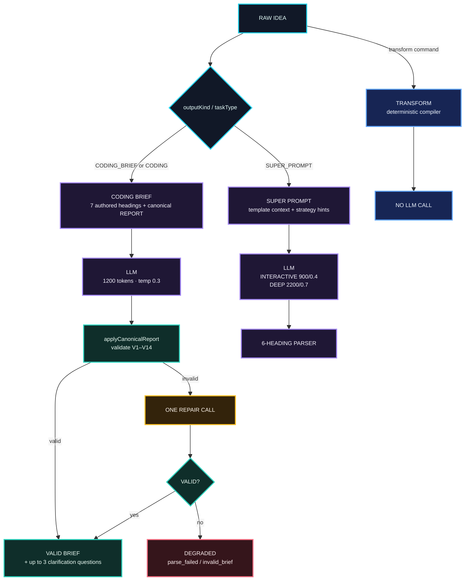
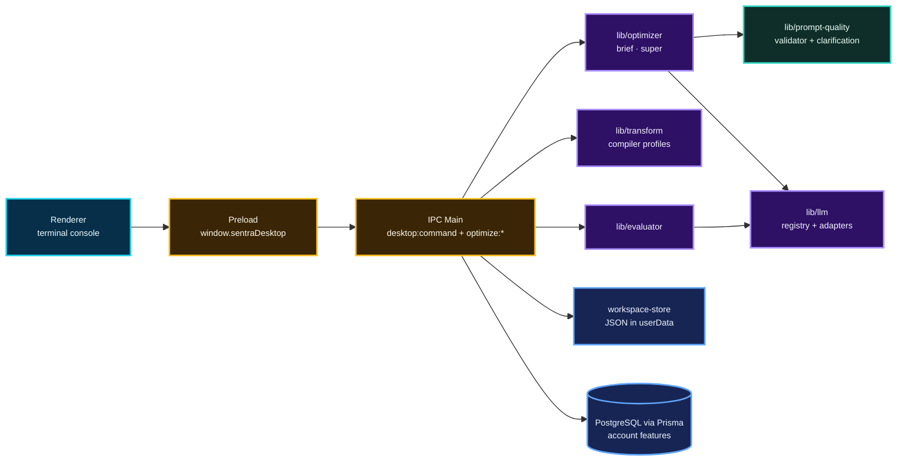

<!--
  MyPrompt — Comprehensive Repository README
  Repository: drferdi/Myprompt
  Package: sentra-prompt
  Version: 0.1.0

  Source basis:
  - MyPrompt technical/product dossier — 23 Sep 2026
  - Current repository main/package contract — cross-checked 24 Sep 2026
  - Historical comprehensive README — visual/reference only, not authority

  README DESIGN — "GAFFER"
  Executive engineering · terminal-native · high signal · evidence first
  Visual grammar follows the established Sentra engineering README language:
  restrained badges, semantic Mermaid diagrams, compact tables, no decorative clutter.

  IMPORTANT
  This README explains the repository. Runtime code, validators, project contracts,
  and applicable SAFRS controls remain authoritative when documentation disagrees.
-->

<div align="center">


# MyPrompt

### Raw idea → verified Coding Brief, Super Prompt, or deterministic model scaffold.

**A terminal-native prompt engineering workspace by Sentra Artificial Intelligence.**

<br />

[](#identity)
[](#identity)
[](#desktop-console)
[](#coding-brief-standard-v30)
[](#providers-and-models)
[](#validator-v1v14)
[](#verified-quality-snapshot)

<br />


<br />

<sub><code>FILL BY DEFAULT · ASK ONLY TO REFINE</code></sub>

<br /><br />


<br /><br />

[Overview](#overview) ·
[Quick Start](#quick-start) ·
[How It Works](#how-prompt-generation-works) ·
[Coding Brief](#coding-brief-standard-v30) ·
[Console](#desktop-console) ·
[Providers](#providers-and-models) ·
[Architecture](#system-architecture) ·
[Quality](#verified-quality-snapshot) ·
[Security](#security-model)

</div>

---

> [!IMPORTANT]
> **MyPrompt is a desktop-only Electron application in the current repository.**
> The renderer is a framework-free terminal-style console. Prompt logic runs in
> the Electron main process. Legacy Next.js-related files and dependencies still
> exist as cleanup candidates, but there is no active Next.js web surface.

> [!NOTE]
> This README is an explanatory repository entrypoint. Where documentation and
> executable behavior disagree, the current runtime code, validator contracts,
> project contract, and applicable SAFRS controls take precedence.

---

## 01 — Overview


MyPrompt turns a raw idea into an execution-ready prompt artifact.

For coding work, the default path produces a **Coding Brief** governed by
Coding Brief Standard v3.0 and validated against rules V1 through V14. For
general prompt engineering, MyPrompt can produce a six-heading **Super Prompt**.
For model-specific scaffolding, `transform` produces a deterministic prompt
shape without calling an LLM.

The product is deliberately narrow:

```text
RAW IDEA
   │
   ├── brief      → validated Coding Brief
   │
   ├── super      → structured Super Prompt
   │
   └── transform  → deterministic model-specific scaffold
```

The daily operating model is equally simple:

```text
Type an idea
    ↓
Generate a complete artifact
    ↓
Validate automatically
    ↓
Clarify only what remains unresolved
    ↓
Copy / save / evaluate / rerun
```

MyPrompt is designed for a single operator preparing briefs for coding agents
and structured prompts for language models.

### What makes it different

| <sub>🟣 **COMPLETE FIRST**</sub> | <sub>🟢 **VERIFY THE SHAPE**</sub> | <sub>🟠 **REFINE, DON'T RESTART**</sub> |
| --- | --- | --- |
| <sub>The default Coding Brief path attempts to produce a usable brief immediately. Questions are not used to postpone the work.</sub> | <sub>Coding Brief output is parsed, normalized, and checked against a deterministic validator contract. A provider saying something plausible is not enough.</sub> | <sub>After a valid brief exists, MyPrompt may offer one clarification round of up to three questions. Answered items are carried into the refined brief instead of rebuilding intent from scratch.</sub> |

---

## 02 — Identity


| <sub>Field</sub> | <sub>Current value</sub> |
| --- | --- |
| <sub>**Product**</sub> | <sub>MyPrompt / Myprompt</sub> |
| <sub>**Package**</sub> | <sub>`sentra-prompt`</sub> |
| <sub>**Version**</sub> | <sub>`0.1.0`</sub> |
| <sub>**Repository**</sub> | <sub>`drferdi/Myprompt`</sub> |
| <sub>**Primary surface**</sub> | <sub>Electron desktop console</sub> |
| <sub>**Renderer**</sub> | <sub>Framework-free text console</sub> |
| <sub>**Default prompt outcome**</sub> | <sub>Coding Brief</sub> |
| <sub>**Other outcomes**</sub> | <sub>Super Prompt · deterministic Transform</sub> |
| <sub>**Primary language model mode**</sub> | <sub>Bring-your-own-provider</sub> |
| <sub>**Node.js**</sub> | <sub>22 or later</sub> |
| <sub>**Package manager**</sub> | <sub>`pnpm@11.21.0`</sub> |
| <sub>**Development model**</sub> | <sub>Standalone SAFRS capsule</sub> |
| <sub>**Governance status**</sub> | <sub>Active capsule · R2 review required before integration or release</sub> |
| <sub>**Creator**</sub> | <sub>Dr. Ferdi Iskandar</sub> |
| <sub>**Organization**</sub> | <sub>Sentra Artificial Intelligence</sub> |

### Naming map

The repository, package, and shell use intentionally related names:

```text
GitHub repository     drferdi/Myprompt
npm package name      sentra-prompt
desktop prompt        sentra ~/myprompt $
product display       MyPrompt
```

---

## 03 — Quick Start


### Prerequisites

Current development/build scripts require:

```text
Node.js >= 22
pnpm 11.21.0
Windows / PowerShell for the current desktop build scripts
```

A provider key is optional for opening the console, but required for:

```text
brief
super
/evaluate
```

Database configuration is only required for account-backed features.

### Clone and run

```bash
git clone https://github.com/drferdi/Myprompt.git
cd Myprompt

pnpm install --frozen-lockfile

# Optional: configure only the integrations you need.
cp .env.example .env.local

pnpm start
```

> [!TIP]
> The application can open without database credentials and without an LLM key.
> Provider-backed commands become available when a supported provider is
> configured.

### Full local verification

```bash
pnpm verify
```

The verification contract runs the repository checks required by the standalone
capsule rather than relying on a parent monorepo.

---

## 04 — Product Modes


### Brief

```text
brief <raw idea>
```

Or simply type text that is not another command.

The default route produces a **Coding Brief**.

```text
Raw idea
   ↓
Coding Brief prompt
   ↓
LLM generation
   ↓
canonical REPORT
   ↓
validator V1–V14
   ↓
valid?
 ┌─┴─────────────┐
yes              no
 │                │
brief          one repair call
 │                │
clarify?       validate again
 │                │
ready        valid / degraded
```

### Super

```text
super <raw idea>
```

Produces a structured six-heading Super Prompt:

```text
ROLE
TASK
CONTEXT
APPROACH        optional
CONSTRAINTS
OUTPUT FORMAT
```

The Super route supports two lanes:

```text
INTERACTIVE
DEEP
```

### Transform

```text
transform <text>
```

Transform is intentionally different.

It is a **pure deterministic string-building path**. It does not call an LLM.

The transformer:

```text
detects intent
selects a profile
applies a mode
applies an effort budget
compiles the scaffold
```

Supported intent classes include:

```text
translation
summarization
analysis
comparison
debugging
explanation
generation
general
```

---

## 05 — How Prompt Generation Works


The optimizer is the main LLM-backed engine.



### Route selection

`lib/optimizer/engine.ts` selects:

```text
CODING_BRIEF
```

when explicitly requested or when:

```text
taskType = CODING
```

Otherwise it selects:

```text
SUPER_PROMPT
```

The `transform` command bypasses the optimizer engine.

---

## 06 — Coding Brief Standard v3.0


> [!NOTE]
> The repository dossier identifies Coding Brief Standard v3.0 as a **draft**.
> Executable validator behavior remains authoritative where prose and code differ.

The Coding Brief standard is built around one operating principle:

> **Fill by default; ask only to refine.**

The engine should make the most conventional defensible proposal instead of
turning every unknown into a blocking question.

### Canonical brief shape

The complete brief is ordered as:

```markdown
## GOAL

## CONTEXT

## SCOPE

## STACK

## OUT OF SCOPE

## DONE WHEN

## ASSUMPTIONS

## REPORT
```

`ASSUMPTIONS` is required when the engine has made proposals.

`REPORT` is canonical text controlled by the engine rather than freely authored
by the provider.

### Section contract

| <sub>Section</sub> | <sub>Requirement</sub> |
| --- | --- |
| <sub>**GOAL**</sub> | <sub>One sentence, maximum 40 words</sub> |
| <sub>**CONTEXT**</sub> | <sub>Real path, filled `New project: <dir>`, or `Explore first:`</sub> |
| <sub>**SCOPE**</sub> | <sub>At least two concrete items unless unresolved TODO handling applies</sub> |
| <sub>**STACK**</sub> | <sub>Includes technologies explicitly mentioned by the operator</sub> |
| <sub>**OUT OF SCOPE**</sub> | <sub>Explicitly bounds what should not be done</sub> |
| <sub>**DONE WHEN**</sub> | <sub>Runnable command, test identifier, or accepted verification fallback</sub> |
| <sub>**ASSUMPTIONS**</sub> | <sub>One readable line per proposal; present when proposals exist</sub> |
| <sub>**REPORT**</sub> | <sub>Exact canonical text appended by the engine</sub> |

### Generation contract

For the Coding Brief route:

```text
provider budget        1200 tokens
temperature            0.3
maximum provider calls 2
repair policy           exactly one repair opportunity
clarification           after a valid brief, not before
maximum questions       3
```

The user prompt given to the provider is intentionally narrow:

```text
RAW IDEA: "..."
```

Optimizer settings are not injected into the Coding Brief itself.

---

## 07 — Validator V1–V14


A Coding Brief is not accepted based on visual plausibility alone.

`lib/prompt-quality/contract.ts` validates the contract.

| <sub>Rule</sub> | <sub>What it checks</sub> |
| --- | --- |
| <sub>**V1**</sub> | <sub>Required headings exist, are ordered, and contain no foreign/duplicate `##` headings</sub> |
| <sub>**V2**</sub> | <sub>No required section is empty</sub> |
| <sub>**V3**</sub> | <sub>GOAL is one sentence and no more than 40 words</sub> |
| <sub>**V4**</sub> | <sub>CONTEXT contains a usable path or accepted exploration marker</sub> |
| <sub>**V5**</sub> | <sub>SCOPE has at least two items unless an accepted TODO condition applies</sub> |
| <sub>**V6**</sub> | <sub>DONE WHEN contains a runnable/verifiable signal</sub> |
| <sub>**V7**</sub> | <sub>DONE WHEN is not merely vague language such as "works" or "runs well"</sub> |
| <sub>**V8**</sub> | <sub>REPORT exactly matches the canonical engine-controlled text</sub> |
| <sub>**V9**</sub> | <sub>Optimizer-control labels such as `Target LLM:` do not leak into the brief</sub> |
| <sub>**V10**</sub> | <sub>Technologies named in the request are represented in STACK</sub> |
| <sub>**V11**</sub> | <sub>Detects a thin brief when both CONTEXT and DONE WHEN are deferred</sub> |
| <sub>**V12**</sub> | <sub>Placeholder language does not simply paraphrase the instruction</sub> |
| <sub>**V13**</sub> | <sub>Greenfield briefs do not retain unresolved `[TODO: ...]` placeholders</sub> |
| <sub>**V14**</sub> | <sub>ASSUMPTIONS is present when the system introduced proposals</sub> |

### Quality verdicts

The Coding Brief metadata can report:

```text
complete
thin
degraded
```

`thin` is valid but warns that both working context and verification are still
deferred.

`degraded` can carry:

```text
parse_failed
invalid_brief
```

A failed refinement does **not** replace the last valid brief already shown to
the operator.

---

## 08 — Clarification Round


Clarification is a refinement phase, not a prerequisite for producing a draft.

Questions are derived mechanically rather than by another LLM call.

Priority order:

```text
1. CONTEXT → Explore first:
2. DONE WHEN → Propose a check first:
3. [TODO: ...] items in SCOPE
4. ASSUMPTIONS
```

The list is capped at three questions.

### Console behavior

```text
type an answer  → apply the answer
press Enter     → keep the proposal
type skip       → end clarification
```

If every answer is empty:

```text
additional provider calls = 0
```

A refinement sends:

```text
RAW IDEA
PREVIOUS BRIEF
ANSWERS FROM THE USER
```

The refinement is instructed to change only what was answered, carry user
answers verbatim, and remove resolved assumptions.

A rerun of a refined brief reuses those same answers.

---

## 09 — Super Prompt


The Super Prompt route uses six structural anchors:

```markdown
## ROLE
## TASK
## CONTEXT
## APPROACH
## CONSTRAINTS
## OUTPUT FORMAT
```

`APPROACH` is optional. The remaining anchors are required by the parser.

### INTERACTIVE

Designed for normal prompt work.

```text
max tokens   900
temperature  0.4
```

If the result is truncated or cannot be parsed, INTERACTIVE gets one recovery
generation with a larger 2200-token budget.

### DEEP

Designed for richer prompt construction.

```text
max tokens   2200
temperature  0.7
```

DEEP can use template context selected through embeddings and cosine similarity.
If embedding retrieval fails, matching falls back to keywords.

DEEP does not use the INTERACTIVE parse-recovery behavior.

### Language behavior

When the input is Indonesian:

```text
content language  → Indonesian
heading anchors   → English
```

The English anchors remain stable because parser behavior depends on them.

---

## 10 — Transform Compiler


`transform` is model-aware but provider-free.

It builds prompt scaffolds for these profiles:

| <sub>Profile</sub> | <sub>Output shape</sub> |
| --- | --- |
| <sub>**default**</sub> | <sub>XML-style sections for Claude-like targets, Markdown sections otherwise</sub> |
| <sub>**claude**</sub> | <sub>`<instructions>` · `<context>` · `<task>` · `<constraints>` · `<output_format>`</sub> |
| <sub>**codex**</sub> | <sub>`# Task` · `## Repository context` · `## Constraints` · `## Acceptance criteria` · `## Verification`</sub> |
| <sub>**gemini**</sub> | <sub>`## System instruction` · `## Context` · `## Task` · `## Constraints` · `## Output schema`</sub> |
| <sub>**grok**</sub> | <sub>`## Objective` · `## Context` · `## Evidence and uncertainty` · `## Constraints` · `## Output`</sub> |

### Effort

Supported levels:

```text
low
medium
high
xhigh
max
```

Current token ceilings:

| <sub>Effort</sub> | <sub>Max tokens</sub> |
| --- | ---: |
| <sub>`low`</sub> | <sub>700</sub> |
| <sub>`medium`</sub> | <sub>1,200</sub> |
| <sub>`high`</sub> | <sub>1,800</sub> |
| <sub>`xhigh`</sub> | <sub>2,600</sub> |
| <sub>`max`</sub> | <sub>3,200</sub> |

`xhigh` and `max` add a constraint that each deliverable appears exactly once.

In the current console path, Transform is pinned to:

```text
model     claude-sonnet
mode      professional
locale    id
target    general
```

---

## 11 — Evaluator


```text
/evaluate <text>
```

The evaluator uses an LLM as a judge.

It scores four dimensions from `0` to `10`:

```text
structure
clarity
completeness
specificity
```

Default weight:

```text
0.25 each
```

Weights can be configured with:

```text
EVAL_WEIGHT_STRUCTURE
EVAL_WEIGHT_CLARITY
EVAL_WEIGHT_COMPLETENESS
EVAL_WEIGHT_SPECIFICITY
```

The final score is normalized to one decimal place.

| <sub>Score</sub> | <sub>Label</sub> |
| ---: | --- |
| <sub>`>= 9`</sub> | <sub>Exceptional</sub> |
| <sub>`>= 7`</sub> | <sub>Good</sub> |
| <sub>`>= 5`</sub> | <sub>Adequate</sub> |
| <sub>`>= 3`</sub> | <sub>Below Average</sub> |
| <sub>`< 3`</sub> | <sub>Poor</sub> |

Unparseable evaluator JSON returns:

```text
EVALUATION_PARSE_FAILED
```

> [!NOTE]
> Evaluator scores and benchmark results are different things. Benchmarks test
> operational budgets; the Evaluator and Coding Brief validator assess quality.

---

## 12 — Providers and Models


Six provider adapters implement a shared contract:

```text
generate
generateStream
validateApiKey
```

The optimizer therefore does not need provider-specific generation logic.

| <sub>Provider code</sub> | <sub>Adapter</sub> | <sub>Default model</sub> | <sub>Credential</sub> |
| --- | --- | --- | --- |
| <sub>`CLAUDE`</sub> | <sub>Anthropic provider</sub> | <sub>`claude-sonnet-4-20250514`</sub> | <sub>`ANTHROPIC_API_KEY`</sub> |
| <sub>`OPENAI`</sub> | <sub>OpenAI provider</sub> | <sub>`gpt-4o`</sub> | <sub>`OPENAI_API_KEY`</sub> |
| <sub>`GROK`</sub> | <sub>OpenAI-compatible xAI provider</sub> | <sub>`grok-3-fast`</sub> | <sub>`XAI_API_KEY`</sub> |
| <sub>`MISTRAL`</sub> | <sub>Mistral provider</sub> | <sub>`mistral-large-latest`</sub> | <sub>`MISTRAL_API_KEY`</sub> |
| <sub>`QWEN`</sub> | <sub>OpenAI-compatible Qwen provider</sub> | <sub>`qwen-plus`</sub> | <sub>`QWEN_API_KEY`</sub> |
| <sub>`LOCAL`</sub> | <sub>Ollama `/api/chat`</sub> | <sub>`llama3`</sub> | <sub>no key required</sub> |

### Guest provider readiness

At startup, the guest provider is selected from available keys in this order:

```text
xAI
OpenAI
Anthropic
Mistral
Qwen
```

If none is available, the console shows a provider-missing state.

### OpenAI-compatible overrides

OpenAI-compatible routes support scoped model/base-URL overrides.

Conceptual precedence:

```text
per-lane
   ↓
per-scope
   ↓
global
```

This allows OpenAI-compatible endpoints to be used without changing the
optimizer engine.

### Key resolution

Provider credentials remain outside the renderer.

For guest/local execution, explicit configuration and environment values are
used.

For signed-in account workflows, provider keys can be stored encrypted in the
database and resolved by the main process.

Stored keys use AES-256-GCM encryption.

---

## 13 — Desktop Console


The entire UI is one terminal-style transcript under a desktop title bar.

There are no application forms or navigation menus.

The interaction model is:

```text
sentra ~/myprompt $ <command or idea>
```

Any normal text that is not another recognized command becomes a Coding Brief.

### Basic commands

| <sub>Command</sub> | <sub>Function</sub> |
| --- | --- |
| <sub>`brief <text>`</sub> | <sub>Build a Coding Brief</sub> |
| <sub>`super <text>`</sub> | <sub>Build a Super Prompt</sub> |
| <sub>`transform <text>`</sub> | <sub>Build a deterministic scaffold</sub> |
| <sub>`lane <interactive</sub> | <sub>deep>`</sub> | <sub>Select optimizer lane</sub> |
| <sub>`profile <default</sub> | <sub>claude</sub> | <sub>codex</sub> | <sub>gemini</sub> | <sub>grok>`</sub> | <sub>Select transform profile</sub> |
| <sub>`effort <low</sub> | <sub>medium</sub> | <sub>high</sub> | <sub>xhigh</sub> | <sub>max>`</sub> | <sub>Select transform effort</sub> |
| <sub>`log`</sub> | <sub>Show recent runs and saved benchmarks</sub> |
| <sub>`key <PROVIDER> <apiKey>`</sub> | <sub>Save a provider key or inspect status</sub> |
| <sub>`stat`</sub> | <sub>Show one-time desktop process telemetry</sub> |
| <sub>`mode`</sub> | <sub>Show active mode, lane, profile, effort, and output</sub> |
| <sub>`copy`</sub> | <sub>Copy the latest result</sub> |
| <sub>`clear`</sub> | <sub>Clear the transcript</sub> |
| <sub>`help`</sub> | <sub>List commands</sub> |
| <sub>`quit`</sub> | <sub>Close MyPrompt</sub> |

### Slash commands

```text
/help
/evaluate <text>
/library
/library search <query>
/library save
/draft save
/recent
/benchmark list
/benchmark save
/benchmark run <id>
/provider
/usage
/subscription upgrade <tier> <interval>
```

Library, usage, and subscription operations require an authenticated session.

### Result actions

After a generated result, keyboard actions can include:

```text
[c] copy
[l] library
[d] draft
[b] benchmark
[r] rerun
[e] evaluate
```

Benchmark rows use:

```text
[b] run
```

---

## 14 — Console Visual Contract


MyPrompt's visual language is intentionally terminal-native.

The UI uses **JetBrains Mono** throughout.

| <sub>Aspect</sub> | <sub>Value</sub> |
| --- | --- |
| <sub>**Font**</sub> | <sub>JetBrains Mono 400 / 500 / 600 / 700</sub> |
| <sub>**Body weight**</sub> | <sub>500</sub> |
| <sub>**Strong weight**</sub> | <sub>700</sub> |
| <sub>**Size**</sub> | <sub>11px</sub> |
| <sub>**Line height**</sub> | <sub>1.45</sub> |
| <sub>**Window/app**</sub> | <sub>`#16191d`</sub> |
| <sub>**Chrome**</sub> | <sub>`#111316`</sub> |
| <sub>**Primary text**</sub> | <sub>`#c5cad3`</sub> |
| <sub>**Strong text**</sub> | <sub>`#ffffff`</sub> |
| <sub>**Dim text**</sub> | <sub>`#8a929e`</sub> |
| <sub>**Prompt/success**</sub> | <sub>`#89ca78`</sub> |
| <sub>**Warning**</sub> | <sub>`#d19a66`</sub> |
| <sub>**Error**</sub> | <sub>`#ef596f`</sub> |
| <sub>**Path**</sub> | <sub>`#61afef`</sub> |
| <sub>**Heading**</sub> | <sub>`#d55fde`</sub> |
| <sub>**Accent**</sub> | <sub>`#2bbac5`</sub> |
| <sub>**Yellow**</sub> | <sub>`#e5c07b`</sub> |

Hierarchy comes primarily from:

```text
color
spacing
alignment
```

—not larger typography.

### Window geometry

First launch:

```text
80 columns × 20 rows
```

The window is measured against the renderer's real character cell and then
persists the operator's chosen size.

The stored window-state format is currently:

```text
version: 7
```

On Windows, the surface remains opaque so ClearType rendering stays active.

---

## 15 — System Architecture




### Process boundary

The renderer does not import `lib/`.

It communicates through:

```text
window.sentraDesktop
```

and receives optimizer events such as:

```text
optimize:status
optimize:chunk
optimize:done
optimize:error
```

Electron is configured with:

```text
contextIsolation: true
nodeIntegration: false
```

---

## 16 — IPC and Runtime


The main `desktop:command` surface handles operations including:

```text
transform:run
optimize:run
evaluate:run
library:*
draft:save
recent:list
benchmark:list
benchmark:save
benchmark:run
templates:list
usage:summary
provider:list
provider:save
provider:delete
subscription:upgrade
```

Separate IPC families handle:

```text
workspace:*
app:get-shell-state
system:stats
window:*
auth:*
```

### Streaming

`optimize:run` returns immediately with a request identifier.

Progress then arrives through events:

```text
preparing
waiting
streaming
```

During Coding Brief repair the console can also show:

```text
Correcting the Coding Brief against the validator...
```

A run finishes through:

```text
optimize:done
```

or:

```text
optimize:error
```

### Provider failure classes

Optimizer failures are normalized as:

```text
PROVIDER_AUTH
RATE_LIMIT
NETWORK
TIMEOUT
UPSTREAM
QUOTA_EXCEEDED
MODEL_ACCESS
UNKNOWN
```

---

## 17 — Data and Storage


Guest operation is local-first.

Normal guest use stores workspace output in Electron's `userData` directory and
does not require PostgreSQL.

### Local files

| <sub>File</sub> | <sub>Purpose</sub> |
| --- | --- |
| <sub>`sentra-desktop-workspace.json`</sub> | <sub>Drafts, recent runs, refinements, benchmarks</sub> |
| <sub>`session.json`</sub> | <sub>Signed-in Supabase session</sub> |
| <sub>`sentra-desktop-window-state.json`</sub> | <sub>Window position, dimensions, state version</sub> |

Workspace writes are serialized and atomic:

```text
write temporary file
    ↓
rename into place
```

Reads and writes are parsed with Zod.

### Database-backed account features

PostgreSQL/Prisma is used for account features such as:

```text
user resolution
tier / quota checks
prompt library
stored provider keys
usage summaries
subscription operations
```

The schema includes models for:

```text
User
UserApiKey
Prompt
Evaluation
PromptTemplate
Subscription
Payment
UsageRecord
FeatureFlag
RateLimitCounter
EmailJob
```

---

## 18 — Repository Structure


Key surfaces:

```text
Myprompt/
├── desktop/
│   ├── bootstrap.ts
│   ├── main.ts
│   ├── preload.ts
│   ├── ipc/
│   └── renderer/
│
├── lib/
│   ├── optimizer/
│   ├── prompt-quality/
│   ├── transform/
│   ├── evaluator/
│   ├── llm/
│   ├── templates/
│   ├── embeddings/
│   ├── billing/
│   ├── auth/
│   ├── desktop/
│   ├── supabase/
│   ├── email/
│   └── db/
│
├── types/
│   └── index.ts
│
├── prisma/
│   ├── schema.prisma
│   └── migrations/
│
├── data/
│   └── templates/
│
├── docs/
│   └── CODING_BRIEF_STANDARD.md
│
├── __tests__/
├── e2e/
├── scripts/
├── project.contract.json
├── package.json
└── README.md
```

The browser extension described in project history is a separate WXT + React
surface and is **not part of the current standalone capsule tree**.

---

## 19 — Testing and Quality Gates


MyPrompt separates several kinds of evidence.

```text
unit / contract tests
lint
typecheck
build
Electron E2E
standalone capsule verification
optimizer acceptance budgets
evaluator quality scoring
Coding Brief contract validation
```

### Commands

| <sub>Gate</sub> | <sub>Command</sub> | <sub>Purpose</sub> |
| --- | --- | --- |
| <sub>Unit / contract</sub> | <sub>`pnpm test`</sub> | <sub>Vitest suite</sub> |
| <sub>Desktop subset</sub> | <sub>`pnpm test:desktop`</sub> | <sub>Desktop-focused Vitest</sub> |
| <sub>Lint</sub> | <sub>`pnpm lint`</sub> | <sub>ESLint</sub> |
| <sub>Typecheck</sub> | <sub>`pnpm typecheck`</sub> | <sub>Prisma generation + strict TypeScript check</sub> |
| <sub>Build</sub> | <sub>`pnpm build`</sub> | <sub>Electron desktop build</sub> |
| <sub>E2E</sub> | <sub>`pnpm test:e2e`</sub> | <sub>Playwright Electron</sub> |
| <sub>Structure</sub> | <sub>`pnpm verify:structure`</sub> | <sub>Capsule boundary</sub> |
| <sub>Extraction</sub> | <sub>`pnpm verify:extraction`</sub> | <sub>Fresh-copy standalone proof</sub> |
| <sub>Deploy dry run</sub> | <sub>`pnpm deploy:dry-run`</sub> | <sub>Non-production deployment check</sub> |
| <sub>Full suite</sub> | <sub>`pnpm verify`</sub> | <sub>Repository verification contract</sub> |

### Standalone proof

`verify:structure` enforces the capsule boundary.

`verify:extraction` proves that a fresh extracted copy can perform the required
lifecycle without depending on the containing monorepo.

That distinction is fundamental to this repository.

---

## 20 — Verified Quality Snapshot


The latest acceptance snapshot documented for **23 September 2026** reported all
four primary gates green:

```text
191 Vitest tests
clean lint
typecheck + build exit code 0
5 Playwright Electron E2E tests
```

The E2E suite covered:

```text
compiler profiles in a real Electron renderer
window overflow / extreme-output containment
optimizer-stage provider-call isolation
80 × 20 first-launch geometry + persisted sizing
mechanical console color/token matching
```

### Mechanical UI verification

The visual contract is not checked by subjective screenshot review alone.

Computed renderer styles are compared against the canonical terminal reference
for properties including:

```text
window background
transcript background
chrome
text
status colors
radius
padding
font size
line height
directory/file colors
```

A mismatch fails the check.

> [!IMPORTANT]
> The counts above are a dated acceptance snapshot, not a promise that future
> revisions will always contain exactly the same number of tests.

---

## 21 — Benchmarks


MyPrompt benchmarks are **budget checks, not quality scores**.

A benchmark case passes when output:

```text
is visible
meets latency budget
meets expected length budget
```

The acceptance harness records:

```text
firstVisibleMs
totalLatencyMs
promptChars
hasVisibleOutput
```

Failure classes include:

```text
visible-output
first-visible
total-latency
prompt-too-short
prompt-too-long
```

### Lane budgets

| <sub>Lane</sub> | <sub>Max first visible</sub> | <sub>Max total</sub> | <sub>Output length</sub> |
| --- | ---: | ---: | --- |
| <sub>**INTERACTIVE**</sub> | <sub>5,000 ms</sub> | <sub>12,000 ms</sub> | <sub>240–2,400 characters</sub> |
| <sub>**DEEP**</sub> | <sub>15,000 ms</sub> | <sub>45,000 ms</sub> | <sub>at least 320 characters</sub> |

The live acceptance artifacts documented on 23 September 2026 used the OpenAI
provider through an OpenAI-compatible route. Every stored output in that run
was a Coding Brief, completed in one provider attempt, with no repair call
required.

---

## 22 — Security Model


### Renderer isolation

```text
contextIsolation = true
nodeIntegration  = false
```

The renderer does not receive provider secrets.

### Secret handling

```text
.env
.env.local
```

are gitignored.

Provider keys are not logged and are not passed into the renderer.

Signed-in stored provider keys use AES-256-GCM encryption.

### Boundary validation

Current prompt and workspace boundaries use Zod validation for:

```text
OptimizeRequest
EvaluateRequest
TransformRequest
template payloads
workspace reads / writes
```

### Known validation gaps

The current dossier identifies several boundaries that still need tightening:

```text
DesktopCommandEnvelopeSchema exists but is not invoked
auth:* payloads are not all schema-validated
window:set-pos is not yet schema-validated
desktop:toggle-mini is not yet schema-validated
```

These are documented gaps, not features.

---

## 23 — Account vs Guest Operation


### Guest

Without a signed-in session:

```text
provider configuration comes from local environment/configuration
database-backed account features are not required
workspace remains local
```

### Signed in

With a Supabase session, account-backed requests can pass through:

```text
tier checks
quota checks
model-access checks
stored provider-key resolution
```

These controls live in the Electron/main-process side rather than the renderer.

---

## 24 — Development Commands


### Run

```bash
pnpm start
pnpm dev
pnpm desktop:dev
```

### Build

```bash
pnpm build
pnpm desktop:build
```

### Test

```bash
pnpm test
pnpm test:desktop
pnpm test:watch
pnpm test:coverage
pnpm test:e2e
pnpm desktop:smoke
```

### Quality

```bash
pnpm lint
pnpm typecheck
pnpm verify
pnpm verify:structure
pnpm verify:extraction
pnpm deploy:dry-run
```

### Acceptance

```bash
pnpm optimizer:acceptance
pnpm desktop:benchmark
```

### Database

```bash
pnpm db:generate
pnpm db:migrate
pnpm db:migrate:deploy
pnpm db:migrate:resolve:init
pnpm db:migrate:apply
pnpm db:seed
```

> [!WARNING]
> `db:seed` currently points to `prisma/seed.ts`, which the source review found
> missing. Treat that command as a known gap until the seed file or script
> contract is corrected.

---

## 25 — Environment Configuration


Configure only the integrations required for the current workflow.

### LLM providers

```text
OPENAI_API_KEY
OPENAI_BASE_URL
OPENAI_MODEL

ANTHROPIC_API_KEY
XAI_API_KEY
MISTRAL_API_KEY
QWEN_API_KEY

OLLAMA_MODEL
LOCAL_MODEL
```

### Database and encryption

```text
DATABASE_URL
DIRECT_URL
ENCRYPTION_KEY
```

### Supabase

```text
NEXT_PUBLIC_SUPABASE_URL
NEXT_PUBLIC_SUPABASE_ANON_KEY
SUPABASE_SERVICE_ROLE_KEY
```

### Optional services

```text
RESEND_API_KEY
RESEND_FROM_EMAIL

XENDIT_SECRET_KEY
XENDIT_CALLBACK_TOKEN

NEXT_PUBLIC_SENTRY_DSN
NEXT_PUBLIC_APP_URL
```

### Desktop runtime

```text
SENTRA_DESKTOP_DEBUG
SENTRA_DESKTOP_SMOKE
SENTRA_DESKTOP_USER_DATA
SENTRA_DESKTOP_PROVIDER
```

> [!NOTE]
> The source review found that `MISTRAL_API_KEY` and `QWEN_API_KEY` are consumed
> by runtime code but were not yet represented in the example environment file
> at the time of the review.

---

## 26 — Standalone Capsule Contract


MyPrompt is developed as a standalone SAFRS capsule.

Current repository governance status:

```text
active SAFRS capsule
R2 review required before integration or release
```

The current lifecycle boundary treats live database migration, provider-side actions,
payment actions, real email delivery, and production packaging/deployment as outside
normal capsule verification scope.

The governing rule is:

> **The project may live inside a monorepo for coordinated development, but it
> must not depend on the monorepo to install, build, test, or run.**

The repository contract therefore treats these as project-local responsibilities:

```text
install
lint
typecheck
test
build
run
deploy dry run
```

### Publication model

The documented publication flow from the containing development repository is:

```text
projects/internal/prompt
        ↓
git subtree split
        ↓
capsule-only history
        ↓
credential / boundary scan
        ↓
project-specific push
        ↓
drferdi/Myprompt
```

Project code is published to its own repository, not to the framework
repository as a substitute.

---

## 27 — Publication Safety


Before publishing a capsule split, the documented workflow checks for:

```text
no committed .env files except .env.example
no strings shaped like API keys
no paths outside the capsule
```

The development repository's pre-push protection also prevents project capsule
ranges from being pushed to the wrong remote without explicit operator
authorization.

This exists to preserve one simple boundary:

```text
framework repository ≠ project publication repository
```

---

## 28 — Known Gaps and Cleanup Candidates


The source review intentionally records unresolved issues rather than hiding
them behind a polished README.

| <sub>Area</sub> | <sub>Current gap</sub> |
| --- | --- |
| <sub>**IPC validation**</sub> | <sub>Several auth/window/mini-mode payloads are not yet schema-validated</sub> |
| <sub>**Command envelope**</sub> | <sub>`DesktopCommandEnvelopeSchema` exists but is not currently invoked</sub> |
| <sub>**Coding Brief docs**</sub> | <sub>V6 runtime behavior is stricter than the prose standard</sub> |
| <sub>**Brownfield rules**</sub> | <sub>V4/V11 documentation and implementation scope do not fully align</sub> |
| <sub>**Stale doc reference**</sub> | <sub>A historical prompt-quality document is referenced from docs but absent from the current capsule</sub> |
| <sub>**Window comments**</sub> | <sub>Some comments still mention 120×30 although runtime target is 80×20</sub> |
| <sub>**Benchmark fixture**</sub> | <sub>`deep-architecture-review` currently routes as Coding Brief although its budget originated as a Super Prompt case</sub> |
| <sub>**Database seed**</sub> | <sub>`db:seed` references a missing `prisma/seed.ts`</sub> |
| <sub>**Generated Prisma client**</sub> | <sub>Generated client is committed although schema output configuration does not explicitly explain it</sub> |
| <sub>**Workspace concurrency**</sub> | <sub>`main.ts` and `core.ts` create separate stores for the same workspace file, so write queues are not shared</sub> |
| <sub>**Legacy web dependencies**</sub> | <sub>Next.js, Radix, Sentry Next.js, Vercel Analytics, and related remnants remain although no active web surface uses them</sub> |

These are backlog material.

They should not be rebranded as product features.

---

## 29 — Documentation vs Runtime


The Coding Brief standard and validator are intended to evolve together.

Where they diverge today, the repository review identified the runtime
validator as the behavioral authority.

That means contributors should verify both:

```text
docs/CODING_BRIEF_STANDARD.md
lib/prompt-quality/contract.ts
```

before changing prompt-contract semantics.

The same principle applies more broadly:

```text
written intent
    ↓
runtime contract
    ↓
executable verification
```

A README is not a substitute for executable behavior.

---

## 30 — Design Principles


MyPrompt's current implementation can be summarized with six operating
principles:

```text
P1  Carry forward what the operator stated.
P2  When a choice is required, propose the conventional option.
P3  Make each proposal explicit and readable by a non-programmer.
P4  Do not propose code that already exists.
P5  Ask questions only to refine an already complete brief.
P6  When ambiguity remains, choose one interpretation and expose alternatives.
```

These principles are why the Coding Brief flow does not begin with an
interrogation.

It begins with an attempt to be useful.

---

## 31 — What MyPrompt Is Not


MyPrompt is not currently:

```text
a web SaaS interface
a generic chat client
an autonomous coding agent
a replacement for repository governance
a hidden-key proxy service
a benchmark leaderboard
a prompt-quality oracle
```

It is a focused desktop tool for turning intent into structured prompt
artifacts and checking that those artifacts satisfy explicit contracts.

---

## 32 — Contributor Orientation


If changing prompt behavior, start with the contract.

```text
Coding Brief
→ docs/CODING_BRIEF_STANDARD.md
→ lib/optimizer/
→ lib/prompt-quality/
→ __tests__/optimizer/

Super Prompt
→ lib/optimizer/super-prompt-format.ts
→ lib/templates/
→ lib/embeddings/

Transform
→ lib/transform/
→ lib/transform/compiler/

Providers
→ lib/llm/providers/

Desktop interaction
→ desktop/ipc/
→ desktop/preload.ts
→ desktop/renderer/

Persistence
→ desktop workspace store
→ prisma/
```

Before widening an interface, check whether the existing contract can be
extended without weakening the standalone boundary.

---

## 33 — Verification Philosophy


MyPrompt does not treat one type of test as a universal substitute.

```text
tsc passes
    ≠
application verified

unit tests pass
    ≠
desktop interaction verified

benchmark passes
    ≠
prompt quality proven

provider output looks good
    ≠
Coding Brief contract satisfied
```

The system combines:

```text
static checks
contract tests
runtime tests
real Electron E2E
acceptance budgets
deterministic validators
```

Each proves something different.

---

## 34 — Current Source-of-Truth Map


| <sub>Concern</sub> | <sub>Primary authority</sub> |
| --- | --- |
| <sub>Package identity / lifecycle</sub> | <sub>`package.json`</sub> |
| <sub>Standalone project contract</sub> | <sub>`project.contract.json`</sub> |
| <sub>Coding Brief prose standard</sub> | <sub>`docs/CODING_BRIEF_STANDARD.md`</sub> |
| <sub>Coding Brief executable validation</sub> | <sub>`lib/prompt-quality/contract.ts`</sub> |
| <sub>Optimizer routing</sub> | <sub>`lib/optimizer/engine.ts`</sub> |
| <sub>Super Prompt parsing</sub> | <sub>`lib/optimizer/super-prompt-format.ts`</sub> |
| <sub>Transform behavior</sub> | <sub>`lib/transform/`</sub> |
| <sub>Provider adapters</sub> | <sub>`lib/llm/providers/`</sub> |
| <sub>Desktop IPC</sub> | <sub>`desktop/ipc/`</sub> |
| <sub>Renderer behavior</sub> | <sub>`desktop/renderer/`</sub> |
| <sub>Data model</sub> | <sub>`prisma/schema.prisma`</sub> |
| <sub>Acceptance harness</sub> | <sub>`scripts/optimizer-acceptance.ts`</sub> |
| <sub>Standalone verification</sub> | <sub>`scripts/verify-structure.mjs` · `scripts/verify-extraction.mjs`</sub> |

---

## 35 — Status


```text
Repository      drferdi/Myprompt
Package         sentra-prompt
Version         0.1.0
Surface         Electron desktop
Default output  Coding Brief
Standard        Coding Brief Standard v3.0
Validator       V1–V14
Lanes           INTERACTIVE · DEEP
Transform       deterministic
Providers       Anthropic · OpenAI · xAI · Mistral · Qwen · Local/Ollama
Node            >= 22
pnpm            11.21.0
```

The repository is active.

The latest documented quality snapshot in the supplied technical dossier is
dated **23 September 2026**.

---

## 36 — The Short Version


```text
An idea enters as text.

MyPrompt decides whether it should become:
a Coding Brief,
a Super Prompt,
or a deterministic model scaffold.

If an LLM is involved, the output is parsed.
If it is a Coding Brief, it is validated.
If something important is still unresolved, clarification happens after the
first complete brief—not before it.

The operator stays in one terminal-like window.
Provider keys stay outside the renderer.
Guest work stays local.
Account features use the database only when needed.
The project remains capable of standing on its own outside the monorepo.
```

That's MyPrompt.

---

<div align="center">

<br />


### Built by Sentra Artificial Intelligence

**Prompt Engineering · Multi-LLM Optimization · AI-Native Tooling**

<br />

[Sentra Artificial Intelligence](https://sentrahai.com)
·
[Repository](https://github.com/drferdi/Myprompt)
·
[Wiki](https://github.com/drferdi/Myprompt/wiki)
·
[Issues](https://github.com/drferdi/Myprompt/issues)

<br />

<sub>
MyPrompt · <code>sentra-prompt</code> · v0.1.0
</sub>

<br /><br />

<sub><code>TYPE AN IDEA · GET A STRUCTURE · VERIFY THE CONTRACT</code></sub>

<br /><br />


</div>
