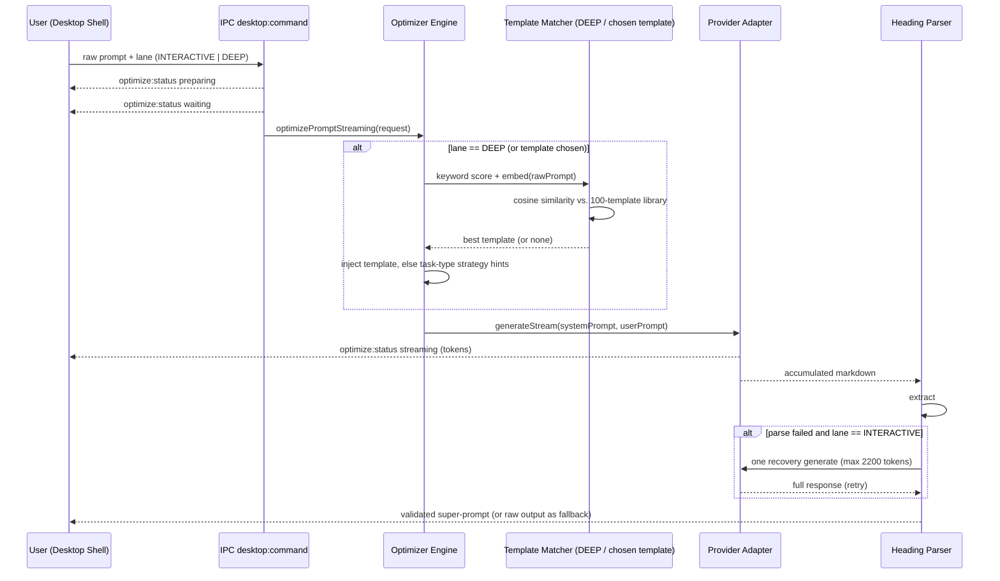
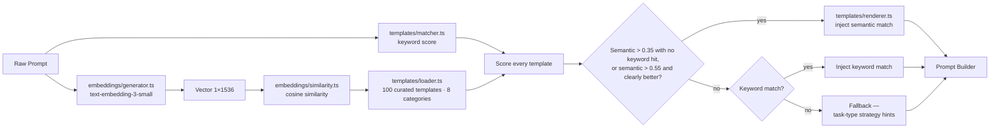
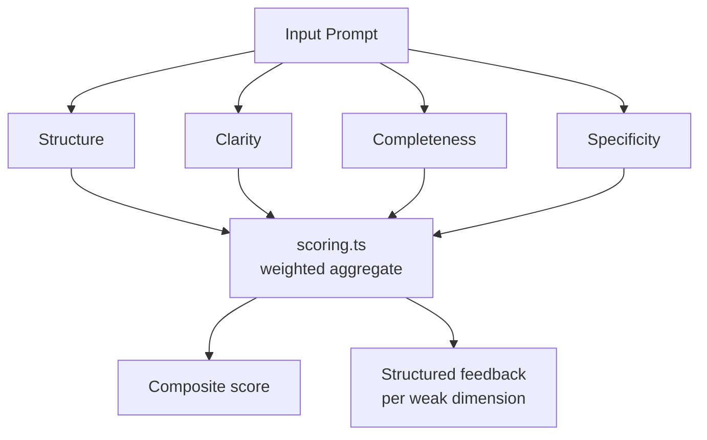
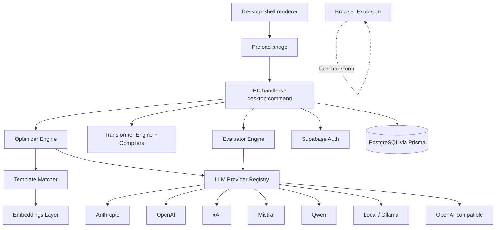

<!--
  Myprompt — Repository README
  Multi-LLM Prompt Transformation Platform
  Built by Dr. Ferdi Iskandar · Sentra Artificial Intelligence
-->

<table width="100%">
<tr>
<td width="28%" align="center" style="vertical-align:middle;">

</td>
<td width="72%" style="vertical-align:middle;">

# Myprompt — _Simplicity_

### Multi-LLM Optimization · Desktop Shell · Real-Time Streaming

<b>Built by Dr. Ferdi Iskandar · Sentra Artificial Intelligence</b><br /> Prompt
Engineering · LLM Infrastructure · Kediri, Indonesia · UTC+7


</td>
</tr>
</table>

---

### What's inside this README

This isn't a usage guide — it's a mechanism guide. Past the front page, every
section traces what actually happens to a prompt between the moment a user hits
"optimize" and the moment a validated six-heading super-prompt comes back. If
you're contributing to `lib/optimizer/`, `lib/templates/`, `lib/transform/`, or
`lib/evaluator/`, start at **Why Six Headings**, then **Core Mechanics**.

`Front Page` · `Why Six Headings` · `Core Mechanics` ·
`Full Feature Map + Engine Internals` · `Provider Matrix` ·
`System Architecture` · `Setup` · `Project Structure` · `Commands` ·
`Tech Stack` · `Security` · `Operating Standard`

---

## ── FRONT PAGE · WHAT THIS IS

Myprompt is a multi-LLM prompt transformation platform. It takes raw,
unstructured ideas and turns them into precision-crafted, structured
super-prompts — optimized for clarity, specificity, and LLM performance across
any provider.

It runs as a native desktop application built on Electron — with real-time
streaming output, two optimizer speed lanes, model-specific prompt compilers,
and full provider flexibility — plus a lightweight browser extension (Chrome and
Firefox) for transforming prompts straight from the browser. Myprompt is a
standalone repository: it installs, builds, tests, and runs on its own, with no
parent monorepo.

<table>
<tr>
<td width="33%" valign="top">

### THE PROBLEM

Raw prompts are vague. Vague prompts produce mediocre LLM output. Most engineers
and clinicians write prompts the same way they write messages — without
structure, without role clarity, and without thinking about how a model actually
parses intent.

</td>
<td width="33%" valign="top">

### THE APPROACH

Every raw input passes through a transformation engine that restructures it into
a six-heading super-prompt: **ROLE · TASK · CONTEXT · APPROACH · CONSTRAINTS ·
OUTPUT FORMAT**. This structure is model-agnostic, provider-agnostic, and
reproducible — and when a specific target model is known, a compiler profile
re-shapes it into that model's preferred dialect.

</td>
<td width="33%" valign="top">

### THE OUTPUT

A production-ready prompt with clear persona assignment, explicit task scoping,
contextual grounding, methodological approach, hard constraints, and output
format specification — ready to paste into any LLM interface.

</td>
</tr>
</table>

---

## ── WHY SIX HEADINGS · THE PROMPT-ENGINEERING CASE

The six-heading format isn't arbitrary — each heading does one specific job in
steering a model's behavior. Drop any one of them and a predictable failure mode
shows up.

<table>
<tr>
<th align="left">Heading</th>
<th align="left">What it controls</th>
<th align="left">What breaks if it's missing</th>
</tr>
<tr>
<td><b>ROLE</b></td>
<td>Persona-conditioning — primes the model's vocabulary, depth, and assumptions ("senior backend engineer" vs. no role at all)</td>
<td>Generic, average-of-the-internet answers with no domain register</td>
</tr>
<tr>
<td><b>TASK</b></td>
<td>An explicit, scoped instruction — one verb, one deliverable</td>
<td>The model guesses intent and answers the wrong question</td>
</tr>
<tr>
<td><b>CONTEXT</b></td>
<td>Domain facts and background the model can't infer on its own</td>
<td>Hallucinated assumptions filling the gap you left open</td>
</tr>
<tr>
<td><b>APPROACH</b></td>
<td>Reasoning method — step-by-step, TDD-first, compare-then-decide</td>
<td>The model picks its own (often shallower) reasoning path</td>
</tr>
<tr>
<td><b>CONSTRAINTS</b></td>
<td>Explicit boundaries — what to avoid, hard limits, edge cases to skip</td>
<td>Scope creep; the model "helpfully" does more than asked</td>
</tr>
<tr>
<td><b>OUTPUT FORMAT</b></td>
<td>Structure, length, tone, rendering target</td>
<td>Unparseable prose where a structured response was needed</td>
</tr>
</table>

**Before / after, condensed:**

```text
RAW INPUT
"write me something about onboarding new employees"

SUPER-PROMPT OUTPUT
ROLE            HR operations specialist with SaaS onboarding experience
TASK            Draft a 5-day new-employee onboarding checklist
CONTEXT         Remote-first team, 10-person engineering org
APPROACH        Sequence by day, front-load access/tooling setup
CONSTRAINTS     No legal/compliance language — that's a separate doc
OUTPUT FORMAT   Markdown checklist, under 400 words
```

The last heading — OUTPUT FORMAT — is also why Myprompt's own parser can extract
structured data from streamed LLM output programmatically. The model is told to
answer with `## ROLE` … `## OUTPUT FORMAT` markdown headings and nothing else;
the parser treats ROLE, TASK, CONTEXT, CONSTRAINTS, and OUTPUT FORMAT as
required and APPROACH as optional. The format isn't just a writing convention;
it's a contract the rest of the pipeline depends on.

---

## ── CORE MECHANICS · HOW THE OPTIMIZER WORKS

The optimizer is the central engine. It does not just reword your input — it
structurally transforms it.

### Step-by-Step Flow

```text
USER INPUT
    │
    ▼
LANE SELECTION
    │   INTERACTIVE — fast, low-latency, ideal for everyday prompts (900 tokens, temp 0.4)
    │   DEEP        — richer, template-matched, ideal for complex or technical prompts (2200 tokens, temp 0.7)
    ▼
PROMPT BUILDER
    │   Assembles a system prompt + formatted user prompt
    │   Template context: an explicitly chosen template, OR (DEEP) automatic
    │   keyword + embedding match against the curated library, OR task-type
    │   strategy hints when no template applies
    │   Detects Bahasa Indonesia input and sets the instruction language
    ▼
LLM STREAMING
    │   Sends assembled prompt to selected provider
    │   Stream opened — tokens arrive in real time
    │   Status events emitted: preparing → waiting → streaming
    │   Empty stream → one non-streaming generate as fallback
    ▼
PARSER
    │   Extracts the super-prompt headings from streamed output
    │   Validates structure — INTERACTIVE gets one recovery pass if parsing fails
    ▼
SUPER-PROMPT OUTPUT
        ROLE            ← Who the LLM should be
        TASK            ← What it must do (precise, scoped)
        CONTEXT         ← Background, domain, constraints
        APPROACH        ← Methodology, reasoning style (optional)
        CONSTRAINTS     ← What to avoid, limits, format rules
        OUTPUT FORMAT   ← Structure, length, tone, rendering
```

### Request Lifecycle — Sequence Diagram



### DEEP Lane — Template Retrieval Internals



The fallback path matters as much as the match path: if nothing in the library
clears the thresholds, DEEP doesn't force a bad match — it injects task-type
strategy hints (emphasis areas and constraints) instead of irrelevant template
context. If the embedding call itself fails, the matcher logs a warning and
falls back to the keyword result.

### Heading Parser — Validation & Retry

`lib/optimizer/super-prompt-format.ts` extracts the headings from streamed
output using structured parsing, not a single greedy regex — it locates every
uppercase `## HEADING` line and slices each section up to the next one. ROLE,
TASK, CONTEXT, CONSTRAINTS, and OUTPUT FORMAT are required; APPROACH is
optional. If a required heading is missing, the INTERACTIVE lane fires one
recovery generation with a larger token budget (2200). If the output still
can't be parsed — or the lane is DEEP — the raw output is returned to the user
as the full prompt rather than failing silently. If the stream comes back empty,
the engine makes one non-streaming request before giving up.

### INTERACTIVE vs DEEP

<table>
<tr>
<th align="left">Dimension</th>
<th align="left">INTERACTIVE</th>
<th align="left">DEEP</th>
</tr>
<tr>
<td><b>Speed</b></td>
<td>Fast — direct prompt build, 900-token budget, temperature 0.4</td>
<td>Slower — adds embedding + template matching, 2200-token budget, temperature 0.7</td>
</tr>
<tr>
<td><b>Template retrieval</b></td>
<td>Only when a template is chosen explicitly</td>
<td>Automatic keyword + semantic cosine similarity against the prompt library</td>
</tr>
<tr>
<td><b>Best for</b></td>
<td>Everyday prompts, quick iterations</td>
<td>Complex, technical, or high-stakes prompts</td>
</tr>
<tr>
<td><b>Status events</b></td>
<td>preparing → waiting → streaming</td>
<td>preparing → waiting → streaming (waiting covers retrieval)</td>
</tr>
<tr>
<td><b>Output depth</b></td>
<td>Standard structured super-prompt</td>
<td>Richer super-prompt with retrieval-informed context</td>
</tr>
<tr>
<td><b>Extra token overhead</b></td>
<td>Strategy hints only</td>
<td>Template context adds to prompt length</td>
</tr>
<tr>
<td><b>Failure mode</b></td>
<td>Heading parse failure → one recovery pass, then raw output</td>
<td>Heading parse failure → raw output; no template match → strategy-hint fallback</td>
</tr>
</table>

---

## ── FULL FEATURE MAP · WHAT IT SHIPS

<table>
<tr>
<td width="50%" valign="top">

### 01 · OPTIMIZER

**Raw Idea → Structured Super-Prompt**

Takes any raw input — a sentence, a fragment, a rough idea — and produces a
six-heading super-prompt. Two lanes: INTERACTIVE for speed, DEEP for depth.
Real-time streaming with live status display. Tuned per task type (coding,
email, analysis, creative, research, business, education, marketing, general),
tone, and output format.

**Format enforced:** ROLE · TASK · CONTEXT · APPROACH · CONSTRAINTS · OUTPUT
FORMAT

</td>
<td width="50%" valign="top">

### 02 · TRANSFORMER

**Prompt Rewriting Engine + Model Compilers**

Rewrites existing prompts across tone, persona, and intent dimensions. Switch
between professional, creative, technical, academic, and casual modes. Preserves
the core meaning while restructuring delivery for a specific LLM audience. Runs
locally and deterministically — no provider call — with intent detection and
token estimation.

**Compiler profiles:** Claude (XML-tagged sections) · Codex · Gemini · Grok —
each compiles the same intent into that model's preferred prompt dialect, with
effort levels from `low` to `max`, a `general` or `agent` target, and Indonesian
(`id`, default) or English (`en`) output.

**Use case:** adapting a prompt written for GPT-4o to work better with Claude,
or shifting from technical to plain language.

</td>
</tr>
<tr>
<td width="50%" valign="top">

### 03 · EVALUATOR

**Prompt Quality Scoring**

Scores any prompt across four dimensions: structure, clarity, completeness, and
specificity. An LLM grades each dimension against a written rubric and returns
structured feedback on the weak spots. Does not rewrite — it diagnoses.

**Dimensions:** Structure · Clarity · Completeness · Specificity

</td>
<td width="50%" valign="top">

### 04 · DESKTOP SHELL

**Native Electron Terminal Interface**

A console-style desktop application for running Optimizer, Transformer, and
Evaluator locally. No browser required. Full real-time streaming.
Keyboard-driven, dark-themed, purpose-built for prompt engineering sessions,
with a mini-window mode, drafts, recent history, and a benchmark view.

**Platform:** Windows (the build scripts are PowerShell-based today) · IPC
bridge for main–renderer communication

</td>
</tr>
<tr>
<td colspan="2" valign="top">

### 05 · BAHASA NATIVE

**Native Indonesian Prompt Engineering**

Processes raw input directly in Bahasa Indonesia — no forced translation pass
before optimization. The prompt builder detects Indonesian input and sets
Bahasa Indonesia as the instruction language. The six headings keep their
English `## ROLE` … `## OUTPUT FORMAT` anchors (the parser depends on them),
while everything written under them stays in Indonesian — so the structural
rigor doesn't get lost going from English to Indonesian:

`PERAN (Role) · TUGAS (Task) · KONTEKS (Context) · PENDEKATAN (Approach) · BATASAN (Constraints) · FORMAT KELUARAN (Output Format)`

<p align="center">

</p>

**Use case:** clinical, academic, or corporate teams in Indonesia who write
instructions directly in Bahasa Indonesia, without translating them into
English first.

</td>
</tr>
</table>

### Engine Internals — Mechanism Notes

These are implementation-level notes for contributors working inside `lib/`.
Where exact constants live in code rather than docs, that's flagged explicitly
instead of guessed at.

**Optimizer — lanes and strategy hints.** `lib/optimizer/engine.ts` owns lane
behavior: INTERACTIVE runs with a 900-token budget at temperature 0.4, DEEP with
2200 tokens at 0.7 plus automatic template retrieval. `lib/optimizer/strategies.ts`
supplies task-type strategy hints — emphasis areas, extra constraints, and a
reasoning focus for each of the nine task types — combined with tone and
output-format constraints. Adding a task type means adding one entry to that
map, not touching the engine.

**Transformer — mode matrix.** Each mode shifts the same four levers: tone
marker, sentence length, vocabulary register, and structural change. The
personas and styles live in `lib/transform/engine.ts`; the per-model dialects
live in `lib/transform/compiler/`.

<table>
<tr>
<th align="left">Mode</th>
<th align="left">Tone marker</th>
<th align="left">Vocabulary register</th>
<th align="left">Structural change</th>
</tr>
<tr>
<td><b>Casual</b></td>
<td>Relaxed, friendly, direct address</td>
<td>Everyday words, minimal jargon</td>
<td>Shorter sentences, fewer subordinate clauses</td>
</tr>
<tr>
<td><b>Professional</b></td>
<td>Formal, results-oriented</td>
<td>Domain-standard terminology, supporting data and facts</td>
<td>Structured sections, clear topic sentences</td>
</tr>
<tr>
<td><b>Creative</b></td>
<td>Expressive, engaging, emotionally resonant</td>
<td>Broader, more associative vocabulary</td>
<td>Looser structure, room for narrative framing</td>
</tr>
<tr>
<td><b>Technical</b></td>
<td>Precise, unambiguous</td>
<td>Field-specific terms, code examples, best practices</td>
<td>Numbered steps, explicit preconditions and edge cases</td>
</tr>
<tr>
<td><b>Academic</b></td>
<td>Objective, scholarly</td>
<td>Scientific terminology, theoretical frameworks</td>
<td>Methodology first, references where appropriate</td>
</tr>
</table>

**Evaluator — scoring methodology.** `lib/evaluator/engine.ts` asks the selected
provider to grade the prompt against the rubric in `lib/evaluator/dimensions.ts`
and return JSON; `lib/evaluator/scoring.ts` normalizes the four scores and
combines them into one weighted composite.



What each dimension actually checks:

- **Structure** — organization, logical flow, and clear sections.
- **Clarity** — language precision and the absence of ambiguity.
- **Completeness** — whether all necessary context, constraints, and
  specifications are included.
- **Specificity** — concrete instructions versus vague generalities.

_Weights default to 0.25 each and can be tuned with `EVAL_WEIGHT_STRUCTURE`,
`EVAL_WEIGHT_CLARITY`, `EVAL_WEIGHT_COMPLETENESS`, and `EVAL_WEIGHT_SPECIFICITY`;
they are normalized to sum to 1 in `dimensions.ts`._

**Desktop shell — IPC contract.** Every renderer action goes through the preload
bridge to a typed handler in `desktop/ipc/` — engine actions share one
`desktop:command` channel — and is validated at the boundary (see Security,
below) before it reaches Electron's main process. The renderer never gets direct
Node access — `nodeIntegration` stays off and `contextIsolation` stays on.

---

## ── PROVIDER MATRIX · LLM SUPPORT

<table>
<tr>
<th align="left">Provider</th>
<th align="left">Models Available</th>
<th align="left">Mode</th>
</tr>
<tr>
<td><b>Anthropic</b></td>
<td>Claude — default <code>claude-sonnet-4-20250514</code>, any model by override</td>
<td>API key (BYOK)</td>
</tr>
<tr>
<td><b>OpenAI</b></td>
<td>Default <code>gpt-4o</code>, any model via <code>OPENAI_MODEL</code></td>
<td>API key (BYOK)</td>
</tr>
<tr>
<td><b>xAI</b></td>
<td>Grok — default <code>grok-3-fast</code></td>
<td>API key (BYOK)</td>
</tr>
<tr>
<td><b>Mistral</b></td>
<td>Default <code>mistral-large-latest</code></td>
<td>API key (BYOK)</td>
</tr>
<tr>
<td><b>Qwen</b></td>
<td>Default <code>qwen-plus</code> (Alibaba DashScope)</td>
<td>API key (BYOK)</td>
</tr>
<tr>
<td><b>Local</b></td>
<td>Default <code>llama3</code> via Ollama</td>
<td>Local endpoint, no key</td>
</tr>
<tr>
<td><b>OpenAI-compatible</b></td>
<td>Any model via custom base URL, with per-lane models for OpenRouter</td>
<td>OpenRouter, Pioneer, local endpoint</td>
</tr>
</table>

BYOK = Bring Your Own Key. Keys come from the local `.env.local`, or from a
user's own saved key, which is stored in PostgreSQL only as AES-256-GCM
ciphertext. Keys are never committed and never logged.

Every provider in `lib/llm/providers/` implements the same adapter contract —
`generate()`, `generateStream()`, and `validateApiKey()` — which the engine
layer calls without knowing which provider is underneath. Models can be
overridden per scope (`OPTIMIZER_OPENAI_MODEL`, `EVALUATOR_OPENAI_MODEL`) and per
lane (`OPTIMIZER_INTERACTIVE_OPENAI_MODEL`, `OPTIMIZER_DEEP_OPENAI_MODEL`).
Adding a new provider means writing one adapter file, not touching the
optimizer, transformer, or evaluator.

---

## ── SYSTEM ARCHITECTURE

```text
DESKTOP SHELL (Electron renderer)
    │
    ▼
PRELOAD BRIDGE → IPC (Electron main process)
    │   desktop:command   → Optimizer / Transformer / Evaluator actions
    │   optimize:status   → preparing · waiting · streaming events
    │   auth:*            → Supabase sign-in, session
    │   workspace:*       → drafts, recent history, benchmarks
    ▼
ENGINE LAYER (lib/)
    │
    ├── optimizer/
    │       engine.ts       ← lane dispatch, prompt build, stream control, recovery
    │       strategies.ts   ← task-type strategy hints (emphasis, constraints)
    │       provider-stream.ts     ← stream collection and typed stream failures
    │       super-prompt-format.ts ← heading parser and formatter
    │
    ├── transform/
    │       engine.ts       ← transformation logic, intent detection
    │       schemas.ts      ← Zod contracts for transform requests
    │       compiler/       ← Claude, Codex, Gemini, Grok dialect compilers
    │
    ├── evaluator/
    │       engine.ts       ← scoring orchestration
    │       dimensions.ts   ← per-dimension rubric and weights
    │       scoring.ts      ← aggregate score computation
    │
    ├── llm/
    │       provider-registry.ts   ← runtime provider and model selection
    │       provider-readiness.ts  ← which providers are configured and usable
    │       providers/             ← per-provider adapters (streaming)
    │       prompt-builder.ts      ← system + user prompt assembly
    │
    ├── templates/
    │       loader.ts       ← reads curated template library (data/templates)
    │       matcher.ts      ← keyword + cosine similarity matching
    │       renderer.ts     ← injects template into the prompt
    │
    └── embeddings/
            generator.ts    ← text → embedding vector
            similarity.ts   ← cosine similarity computation
    ▼
POSTGRESQL (Prisma) · SUPABASE AUTH
    │   Users, sessions, encrypted API keys, usage, rate limits, email queue
    ▼
OPTIONAL SERVICES
        LLM providers · Resend (email) · Xendit (payments) · Sentry (errors)

BROWSER EXTENSION (extension/, standalone)
        Popup UI → local deterministic transform (no API calls) → copy result
```

### Visual Flow

The tree above is the file map. This is the same system as a request-routing
diagram — useful when you're tracing where a call goes rather than where a file
lives.



---

## ── SETUP · STEP BY STEP

**Requirements**

- Node.js ≥ 22
- pnpm 11.21.0
- Windows for the desktop build (its scripts use PowerShell)
- Optional: PostgreSQL / Supabase project for accounts and saved keys
- Optional: at least one LLM provider API key for Optimizer and Evaluator

**Step 1 — Clone and install**

```bash
git clone https://github.com/drferdi/Myprompt.git
cd Myprompt
pnpm install --frozen-lockfile
```

**Step 2 — Configure environment**

```bash
cp .env.example .env.local
```

Open `.env.local` and fill in only what the features you use need. No value is
required to open the desktop shell. Never commit `.env.local`.

| Variable                                          | Description                                   | Needed for         |
| ------------------------------------------------- | --------------------------------------------- | ------------------ |
| `DATABASE_URL`, `DIRECT_URL`                      | PostgreSQL connection strings                 | data operations    |
| `ENCRYPTION_KEY`                                  | Key for AES-256-GCM encryption of saved keys  | saved API keys     |
| `NEXT_PUBLIC_SUPABASE_URL`                        | Supabase project URL                          | accounts           |
| `NEXT_PUBLIC_SUPABASE_ANON_KEY`                   | Supabase anon key                             | accounts           |
| `SUPABASE_SERVICE_ROLE_KEY`                       | Service role key (main process only)          | accounts           |
| `ANTHROPIC_API_KEY`                               | Anthropic (Claude)                            | optional           |
| `OPENAI_API_KEY`                                  | OpenAI or OpenAI-compatible endpoint          | optional           |
| `OPENAI_BASE_URL`, `OPENAI_MODEL`                 | Custom endpoint (e.g. OpenRouter) and model   | optional           |
| `XAI_API_KEY`                                     | xAI Grok                                      | optional           |
| `MISTRAL_API_KEY`                                 | Mistral                                       | optional           |
| `QWEN_API_KEY`                                    | Qwen (DashScope)                              | optional           |
| `OLLAMA_MODEL`, `LOCAL_MODEL`                     | Local model selection                         | optional           |
| `RESEND_API_KEY`, `RESEND_FROM_EMAIL`             | Transactional email                           | optional           |
| `XENDIT_SECRET_KEY`, `XENDIT_CALLBACK_TOKEN`      | Payments                                      | optional           |
| `NEXT_PUBLIC_SENTRY_DSN`                          | Error tracking                                | optional           |

**Step 3 — Initialize database**

```bash
pnpm db:generate     # generate Prisma client (safe placeholder URL, no connection)
pnpm db:migrate      # apply migrations — only in an approved environment
```

**Step 4 — Start the desktop app**

```bash
pnpm start           # builds and launches the Electron desktop app
```

**Step 5 — (Optional) Run the browser extension**

```bash
cd extension
pnpm install
pnpm dev             # Chrome · use pnpm dev:firefox for Firefox
```

---

## ── PROJECT STRUCTURE

```text
Myprompt/
│
├── desktop/                    Electron desktop shell
│   ├── bootstrap.ts            Process entry point
│   ├── main.ts                 Electron main process, window manager
│   ├── preload.ts              Context bridge
│   ├── ipc/                    IPC handlers (core, auth, workspace, provider keys, …)
│   └── renderer/               Terminal-style console UI
│
├── lib/                        Core engine layer
│   ├── optimizer/              Prompt optimization engine
│   ├── transform/              Prompt rewriting engine + model compilers
│   ├── evaluator/              Prompt scoring engine
│   ├── llm/                    LLM provider adapters + registry
│   ├── templates/              Template library loader + matcher
│   ├── embeddings/             Vector generation + similarity
│   ├── desktop/                Desktop session and product contracts
│   ├── auth/                   Auth guards and rate limiting
│   ├── billing/                Plan enforcement and subscription (Xendit)
│   ├── email/                  Email queue and welcome mail (Resend)
│   ├── db/                     Prisma client singleton
│   ├── supabase/               Supabase client variants (server, browser, admin)
│   └── prompt-quality/         Quality scoring contracts
│
├── extension/                  Browser extension (WXT + React, standalone)
├── data/templates/             Curated template library (100 templates)
│
├── prisma/                     Database schema + migrations
│   ├── schema.prisma
│   └── migrations/
│
├── tests/                      Test suites
│   ├── unit/                   Vitest unit tests
│   └── e2e/                    Playwright Electron end-to-end tests
├── scripts/                    Acceptance harness, verification, and utilities
├── public/                     Static assets
├── types/                      Global TypeScript types
│
├── docs/                       Architecture, operations, data, testing, release
│
├── AGENTS.md                   Agent workflow and task protocol
├── project.contract.json       Standalone lifecycle contract
├── .env.example                Environment variable template
└── package.json
```

---

## ── COMMANDS REFERENCE

```bash
# Development
pnpm start                  # build and launch the desktop app
pnpm desktop:dev            # same, for iterative desktop work
pnpm build                  # compile the Electron shell

# Testing
pnpm test                   # run all Vitest tests
pnpm test:desktop           # desktop-specific tests
pnpm test:e2e               # Playwright Electron end-to-end tests
pnpm desktop:smoke          # controlled startup check

# Database
pnpm db:generate            # generate Prisma client
pnpm db:migrate             # apply migrations (approved environment only)
pnpm db:seed                # seed data

# Quality
pnpm lint                   # ESLint
pnpm typecheck              # TypeScript strict check
pnpm verify                 # full local gate: structure, lint, types, tests, build, smoke, deploy dry-run
pnpm verify:extraction      # prove the repo runs from a clean copy

# Optimizer acceptance harness
pnpm optimizer:acceptance   # live end-to-end test with real provider
pnpm desktop:benchmark      # same harness, JSON output
```

---

## ── TECH STACK


---

## ── SECURITY

<table>
<tr>
<td width="50%" valign="top">

### API KEY SAFETY

Provider keys live in the local `.env.local` or, when a user saves their own,
in PostgreSQL as AES-256-GCM ciphertext. They are never committed, never
logged, and never handed to the renderer. BYOK by design.

</td>
<td width="50%" valign="top">

### NO PHI / NO PII

This is a prompt engineering tool. It does not process patient data, clinical
records, or personally identifiable information. Error tracking via Sentry is
optional (off without a DSN) and scoped to technical errors only.

</td>
</tr>
<tr>
<td width="50%" valign="top">

### ENVIRONMENT ISOLATION

`.env` and `.env.local` files are gitignored. The `.env.example` contains only
empty placeholders. Service role credentials stay in the Electron main process
and are never exposed to the renderer.

</td>
<td width="50%" valign="top">

### ELECTRON CONTEXT BRIDGE

The desktop shell uses a strict preload context bridge. `contextIsolation` is
on and `nodeIntegration` is disabled. All IPC communication is typed and
validated at the boundary before reaching the main process.

</td>
</tr>
</table>

---

## ── THE OPERATING STANDARD

```text
No prompt output without structure.
No provider switch without explicit user selection.
No API key in any log, error payload, or Sentry event.
No feature without a failing test to define it first.
No desktop action without IPC validation at the boundary.
```

<table>
<tr>
<th align="left">Question</th>
<th align="left">Required answer</th>
</tr>
<tr>
<td><b>What is the prompt trying to do?</b></td>
<td>Specific task with clear ROLE and OUTPUT FORMAT — not a vague instruction.</td>
</tr>
<tr>
<td><b>Which lane is appropriate?</b></td>
<td>INTERACTIVE for speed; DEEP for complex or high-stakes prompts.</td>
</tr>
<tr>
<td><b>Which provider is handling it?</b></td>
<td>Explicit user selection — the model comes from a declared override or the provider's documented default, never a silent switch.</td>
</tr>
<tr>
<td><b>What can go wrong?</b></td>
<td>Empty stream, heading parse failure, provider rate limit — all handled explicitly.</td>
</tr>
<tr>
<td><b>How is it verified?</b></td>
<td>Acceptance harness runs against real provider endpoints; <code>pnpm verify</code> and Electron E2E gate every change. No fabricated test output.</td>
</tr>
</table>

---

## ── LETS CONNECT

[](https://linkedin.com/in/dr-ferdi-iskandar-1b620a3b5)
[](https://x.com/ClaudesyI81047)
[](https://discord.gg/1511829076313374745)
[](https://medium.com/@codieverse)
[](https://tiktok.com/@drferdii)
[](mailto:drferdiiskandar@gmail.com)

---

<p align="center">
  <b>Myprompt · Simplicity — built to make every prompt count.</b><br />
  <sub>Sentra Artificial Intelligence · Dr. Ferdi Iskandar · Indonesia</sub>
</p>
