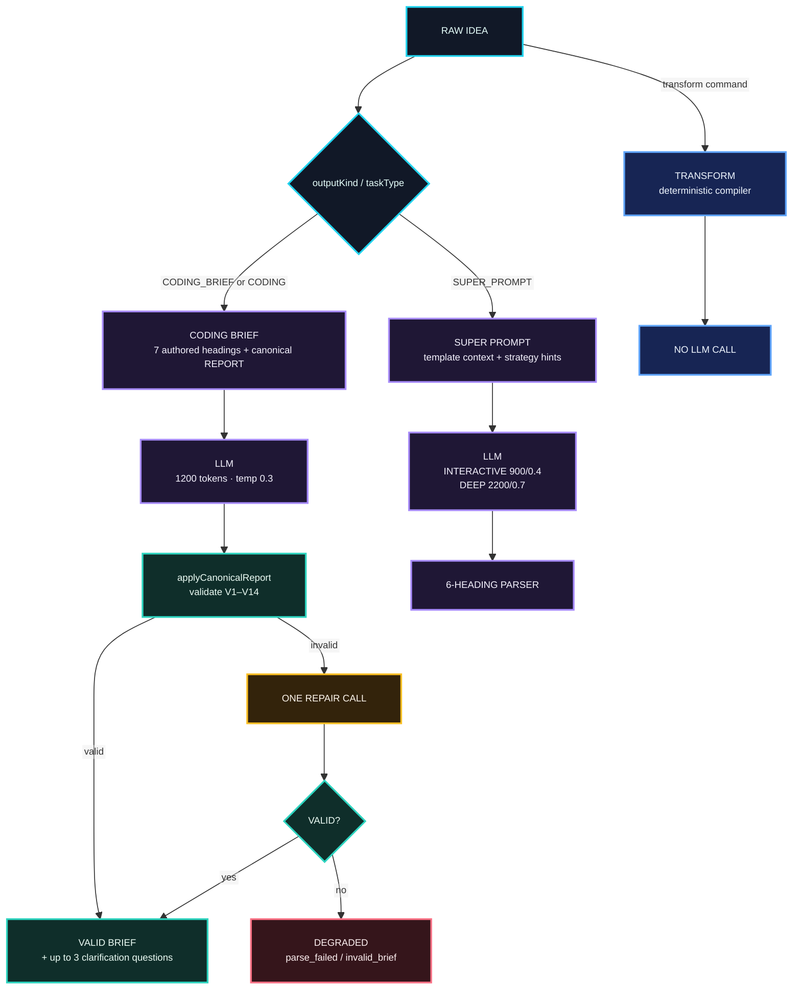
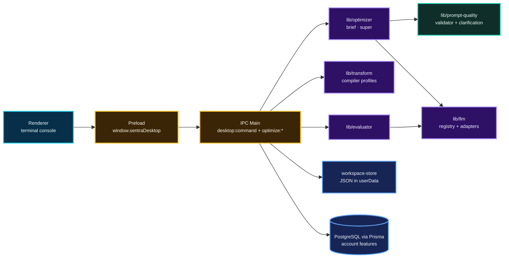

<!--
MyPrompt — Comprehensive Repository README
Repository: drferdi/Myprompt
Package: sentra-prompt
Version: 0.1.0
Source basis:
  - MyPrompt technical/product dossier — 23 Sep 2026
  - Current repository main/package contract — cross-checked 24 Sep 2026
  - Prose rewritten for readability — 24 Sep 2026 (facts unchanged)
  - Historical comprehensive README — visual/reference only, not authority

README DESIGN — "GAFFER"
Executive engineering · terminal-native · high signal · evidence first
Visual grammar follows the established Sentra engineering README language:
restrained badges, semantic Mermaid diagrams, compact tables, no decorative clutter.

IMPORTANT
This README explains the repository. Runtime code, validators, project contracts,
and applicable SAFRS controls remain authoritative when documentation disagrees.
-->

<div align="center">


### Turn a half-baked idea into a brief your AI can actually run with.

**A terminal-native prompt engineering workspace by Sentra Artificial Intelligence.**

<br />

[](#identity)
[](#identity)
[](#desktop-console)
[](#coding-brief)
[](#providers)
[](#validator)
[](#quality)

<br />


<br />

<sub><code>FILL BY DEFAULT · ASK ONLY TO REFINE</code></sub>

<br />


<br />

[Overview](#overview) ·
[Quick Start](#quick-start) ·
[Coding Brief](#coding-brief) ·
[Validator](#validator) ·
[Console](#desktop-console) ·
[Providers](#providers) ·
[Architecture](#architecture) ·
[Quality](#quality) ·
[Known Gaps](#known-gaps)

</div>

---

> [!IMPORTANT]
> MyPrompt is currently a desktop-only Electron application. The renderer is a
> framework-free, terminal-style console, and all prompt logic runs in the
> Electron main process. Some legacy Next.js files and dependencies are still in
> the tree as cleanup candidates, but there is no active Next.js web surface.

> [!NOTE]
> This README explains the repository. When it disagrees with the runtime code,
> validator contracts, project contract, or applicable SAFRS controls, those win.

---

<a id="overview"></a>

## 01 — Overview 

Ask a coding assistant for a login page and you can spend twenty minutes
answering its questions before it writes a single line. MyPrompt flips that
order. Its house rule is *fill by default, ask only to refine*. You type a raw
idea, you get back a complete, validated artifact, and questions show up
afterward only if something still needs your call.

MyPrompt is a terminal-native prompt engineering workspace built by Sentra
Artificial Intelligence. It runs as an Electron desktop app and turns rough
intent into one of three things:

```text
RAW IDEA
   │
   ├── brief      → validated Coding Brief
   │
   ├── super      → structured Super Prompt
   │
   └── transform  → deterministic model-specific scaffold
```

Day to day, the loop is short: type an idea, get a complete artifact, let the
validator check it, answer a question or two if anything is still open, then
copy, save, evaluate, or rerun. It is built for a single operator preparing
briefs for coding agents and structured prompts for language models.

---

<a id="identity"></a>

## 02 — Identity 

| Field | Current value |
| --- | --- |
| Product | MyPrompt / Myprompt |
| Package | `sentra-prompt` |
| Version | `0.1.0` |
| Repository | `drferdi/Myprompt` |
| Primary surface | Electron desktop console |
| Renderer | Framework-free text console |
| Default prompt outcome | Coding Brief |
| Other outcomes | Super Prompt · deterministic Transform |
| Language model mode | Bring-your-own-provider |
| Node.js | 22 or later |
| Package manager | `pnpm@11.21.0` |
| Development model | Standalone SAFRS capsule |
| Governance status | Active capsule · R2 review required before integration or release |
| Creator | Dr. Ferdi Iskandar |
| Organization | Sentra Artificial Intelligence |

The names are related on purpose: the GitHub repository is `drferdi/Myprompt`,
the npm package is `sentra-prompt`, the desktop prompt reads
`sentra ~/myprompt $`, and the product is displayed as MyPrompt.

---

<a id="quick-start"></a>

## 03 — Quick Start 

You'll need Node.js 22 or later, pnpm 11.21.0, and, for now, Windows with
PowerShell for the desktop build scripts. The console opens without a provider
key, but `brief`, `super`, and `/evaluate` need one. A database is only needed
for account-backed features.

```bash
git clone https://github.com/drferdi/Myprompt.git
cd Myprompt
pnpm install --frozen-lockfile
# Optional: configure only the integrations you need.
cp .env.example .env.local
pnpm start
```

To run the full verification contract for the standalone capsule:

```bash
pnpm verify
```

---

<a id="coding-brief"></a>

## 04 — Coding Brief: the draft comes first 

Anything you type that isn't another command becomes a Coding Brief, and you
can also ask for one explicitly with `brief <idea>`. Every brief follows Coding
Brief Standard v3.0 (currently a draft; see `docs/CODING_BRIEF_STANDARD.md`)
and always uses the same order:

```markdown
## GOAL
## CONTEXT
## SCOPE
## STACK
## OUT OF SCOPE
## DONE WHEN
## ASSUMPTIONS
## REPORT
```

GOAL is one sentence of 40 words or fewer. CONTEXT names a real path, a filled
`New project: <dir>`, or an `Explore first:` note. SCOPE lists at least two
concrete items. STACK includes every technology you mentioned. OUT OF SCOPE
says what should not be done. DONE WHEN has to be something you can actually
run or check, like a command or a test name. ASSUMPTIONS lists every choice
MyPrompt made on your behalf, one readable line each. REPORT is fixed text that
the engine appends itself, so the model never writes it.

Behind the scenes the model works on a tight budget: 1,200 tokens (a token is
roughly a piece of a word) at a temperature of 0.3, a setting that keeps its
word choices conservative. The model sees only `RAW IDEA: "..."`, and optimizer
settings never leak into the brief. It gets two provider calls at most. The
first writes the brief, and if that draft fails validation, exactly one repair
attempt follows. While the repair runs, the console shows
`Correcting the Coding Brief against the validator...`.



`lib/optimizer/engine.ts` picks the `CODING_BRIEF` route when it is requested
explicitly or when `taskType = CODING`, and `SUPER_PROMPT` otherwise. The
`transform` command bypasses the optimizer engine entirely.

The whole flow rests on six principles, which is why it opens with an attempt
to be useful instead of an interrogation:

```text
P1  Carry forward what the operator stated.
P2  When a choice is required, propose the conventional option.
P3  Make each proposal explicit and readable by a non-programmer.
P4  Do not propose code that already exists.
P5  Ask questions only to refine an already complete brief.
P6  When ambiguity remains, choose one interpretation and expose alternatives.
```

---

<a id="validator"></a>

## 05 — Checked by a validator 

Every Coding Brief goes through a validator defined in
`lib/prompt-quality/contract.ts`. Fourteen rules, V1 to V14, check that
headings are present, in order, and free of duplicates (V1); that no section is
empty (V2); that GOAL stays within 40 words (V3); that CONTEXT is usable (V4);
that SCOPE has at least two items (V5); that DONE WHEN is verifiable (V6) and
not vague filler like "works well" (V7); that REPORT matches the canonical text
exactly (V8); that optimizer labels such as `Target LLM:` don't slip in (V9);
that every technology you named appears in STACK (V10); that a thin brief gets
flagged when CONTEXT and DONE WHEN are both deferred (V11); that placeholders
don't just parrot the instruction (V12); that a greenfield brief has no
leftover `[TODO: ...]` items (V13); and that ASSUMPTIONS appears whenever the
system made proposals (V14).

Each brief then gets a verdict. `complete` means it passed cleanly. `thin`
means it is valid but still waiting on both working context and a way to verify
it. `degraded` means the output couldn't be parsed (`parse_failed`) or broke the
rules (`invalid_brief`). If a later refinement goes sideways, your last valid
brief stays on screen.

---

<a id="clarification"></a>

## 06 — Questions come last 

Once a valid brief exists, MyPrompt may offer one clarification round of up to
three questions. They are picked mechanically, with no extra LLM call, in this
priority order: CONTEXT still marked `Explore first:`, DONE WHEN still marked
`Propose a check first:`, any `[TODO: ...]` items in SCOPE, and then
ASSUMPTIONS.

```text
type an answer  → apply the answer
press Enter     → keep the proposal
type skip       → end clarification
```

If you leave every answer blank, the round costs zero extra provider calls.
When you do answer, the refinement receives the RAW IDEA, the PREVIOUS BRIEF,
and your ANSWERS FROM THE USER. It changes only what you answered, carries your
words verbatim, and removes the assumptions you resolved. Rerunning a refined
brief reuses the same answers, so you never repeat yourself.

---

<a id="super-prompt"></a>

## 07 — Super Prompt 

For general prompt engineering, `super <idea>` builds a Super Prompt under six
anchors: ROLE, TASK, CONTEXT, APPROACH (optional), CONSTRAINTS, and OUTPUT
FORMAT. You choose the lane with `lane interactive` or `lane deep`.

INTERACTIVE handles everyday work at 900 tokens and temperature 0.4. If the
result gets cut off or won't parse, it gets one recovery run at 2,200 tokens.
DEEP goes bigger, with 2,200 tokens at temperature 0.7, a looser setting that
leaves room for richer phrasing. DEEP can also pull in relevant templates using
embeddings and cosine similarity (a mathematical way of measuring how close two
texts are in meaning), and it falls back to keyword matching if that retrieval
fails. DEEP skips the INTERACTIVE recovery step.

Write in Indonesian and the content comes back in Indonesian, while the heading
anchors stay in English so the parser can always find them.

---

<a id="transform"></a>

## 08 — Transform 

`transform <text>` is the odd one out on purpose, because it never calls an
LLM. It is a pure string-building path that detects your intent (translation,
summarization, analysis, comparison, debugging, explanation, generation, or
general), selects a profile, applies a mode and an effort budget, and compiles
a deterministic scaffold. Deterministic means the same input always produces
the same output.

| Profile | Output shape |
| --- | --- |
| default | XML-style sections for Claude-like targets, Markdown sections otherwise |
| claude | `<instructions>` · `<context>` · `<task>` · `<constraints>` · `<output_format>` |
| codex | `# Task` · `## Repository context` · `## Constraints` · `## Acceptance criteria` · `## Verification` |
| gemini | `## System instruction` · `## Context` · `## Task` · `## Constraints` · `## Output schema` |
| grok | `## Objective` · `## Context` · `## Evidence and uncertainty` · `## Constraints` · `## Output` |

Effort runs from low to max, with ceilings of 700, 1,200, 1,800, 2,600, and
3,200 tokens for `low`, `medium`, `high`, `xhigh`, and `max`. The top two
levels also require every deliverable to appear exactly once. In the current
console, Transform is pinned to `claude-sonnet`, `professional` mode, the
Indonesian (`id`) locale, and the `general` target.

---

<a id="evaluator"></a>

## 09 — Evaluator 

`/evaluate <text>` puts an LLM in the judge's chair. It scores structure,
clarity, completeness, and specificity from 0 to 10, weighted 0.25 each by
default. You can adjust the weights with `EVAL_WEIGHT_STRUCTURE`,
`EVAL_WEIGHT_CLARITY`, `EVAL_WEIGHT_COMPLETENESS`, and
`EVAL_WEIGHT_SPECIFICITY`.

The final score is rounded to one decimal and maps to Exceptional (9 and up),
Good (7 and up), Adequate (5 and up), Below Average (3 and up), or Poor. If the
judge returns JSON that can't be read, you get `EVALUATION_PARSE_FAILED`
instead of a made-up number.

---

<a id="providers"></a>

## 10 — Bring your own provider 

Six adapters share one contract (`generate`, `generateStream`, and
`validateApiKey`), so the optimizer works the same with any of them:

| Provider code | Adapter | Default model | Credential |
| --- | --- | --- | --- |
| `CLAUDE` | Anthropic | `claude-sonnet-4-20250514` | `ANTHROPIC_API_KEY` |
| `OPENAI` | OpenAI | `gpt-4o` | `OPENAI_API_KEY` |
| `GROK` | OpenAI-compatible xAI | `grok-3-fast` | `XAI_API_KEY` |
| `MISTRAL` | Mistral | `mistral-large-latest` | `MISTRAL_API_KEY` |
| `QWEN` | OpenAI-compatible Qwen | `qwen-plus` | `QWEN_API_KEY` |
| `LOCAL` | Ollama `/api/chat` | `llama3` | no key required |

Without a signed-in session, MyPrompt picks a guest provider from whichever
keys you have, in this order: xAI, OpenAI, Anthropic, Mistral, Qwen. If none is
available, it shows a provider-missing state. OpenAI-compatible routes accept
model and base-URL overrides, resolved per lane first, then per scope, then
globally.

When something fails, the error lands in a clear class: `PROVIDER_AUTH`,
`RATE_LIMIT`, `NETWORK`, `TIMEOUT`, `UPSTREAM`, `QUOTA_EXCEEDED`,
`MODEL_ACCESS`, or `UNKNOWN`.

---

<a id="desktop-console"></a>

## 11 — One window, one prompt 

The whole interface is a single terminal-style transcript at the
`sentra ~/myprompt $` prompt, with no forms and no menus.

| Command | Function |
| --- | --- |
| `brief <text>` | Build a Coding Brief |
| `super <text>` | Build a Super Prompt |
| `transform <text>` | Build a deterministic scaffold |
| `lane <interactive\|deep>` | Select optimizer lane |
| `profile <default\|claude\|codex\|gemini\|grok>` | Select transform profile |
| `effort <low\|medium\|high\|xhigh\|max>` | Select transform effort |
| `log` | Show recent runs and saved benchmarks |
| `key <PROVIDER> <apiKey>` | Save a provider key or inspect status |
| `stat` | Show one-time desktop process telemetry |
| `mode` | Show active mode, lane, profile, effort, and output |
| `copy` · `clear` · `help` · `quit` | Copy the latest result · clear · list commands · close |

Slash commands cover the rest:

```text
/help
/evaluate <text>
/library
/library search <query>
/library save
/draft save
/recent
/benchmark list
/benchmark save
/benchmark run <id>
/provider
/usage
/subscription upgrade <tier> <interval>
```

Library, usage, and subscription need a signed-in account. After each result,
single keys do the work: `[c]` copy, `[l]` library, `[d]` draft, `[b]`
benchmark, `[r]` rerun, `[e]` evaluate. On benchmark rows, `[b]` runs the
benchmark.

It looks the part too. Everything is set in JetBrains Mono at 11px with a 1.45
line height, and hierarchy comes from color, spacing, and alignment instead of
bigger type. The first launch opens at 80 columns by 20 rows, measured against
the real character cell, and the app remembers whatever size you pick after
that (window-state format `version: 7`). On Windows the surface stays opaque so
ClearType text stays crisp.

<details>
<summary>Full console visual tokens</summary>

| Aspect | Value |
| --- | --- |
| Font | JetBrains Mono 400 / 500 / 600 / 700 |
| Body weight | 500 |
| Strong weight | 700 |
| Size | 11px |
| Line height | 1.45 |
| Window/app | `#16191d` |
| Chrome | `#111316` |
| Primary text | `#c5cad3` |
| Strong text | `#ffffff` |
| Dim text | `#8a929e` |
| Prompt/success | `#89ca78` |
| Warning | `#d19a66` |
| Error | `#ef596f` |
| Path | `#61afef` |
| Heading | `#d55fde` |
| Accent | `#2bbac5` |
| Yellow | `#e5c07b` |

</details>

---

<a id="architecture"></a>

## 12 — Under the hood 



The renderer, which is the part of the app you see, never imports `lib/` and
never sees your provider secrets. It talks to the Electron main process through
a narrow bridge called `window.sentraDesktop`, with `contextIsolation: true`
and `nodeIntegration: false`.

Requests travel through the `desktop:command` channel:

```text
transform:run
optimize:run
evaluate:run
library:*
draft:save
recent:list
benchmark:list
benchmark:save
benchmark:run
templates:list
usage:summary
provider:list
provider:save
provider:delete
subscription:upgrade
```

Separate IPC families handle `workspace:*`, `app:get-shell-state`,
`system:stats`, `window:*`, and `auth:*`. `optimize:run` replies instantly with
a request ID, streams progress (preparing, waiting, streaming) through
`optimize:status` and `optimize:chunk`, and finishes with `optimize:done` or
`optimize:error`.

### Where your data lives

Guest work is local-first and needs no PostgreSQL. Everything sits in
Electron's `userData` folder:

| File | Purpose |
| --- | --- |
| `sentra-desktop-workspace.json` | Drafts, recent runs, refinements, benchmarks |
| `session.json` | Signed-in Supabase session |
| `sentra-desktop-window-state.json` | Window position, dimensions, state version |

Each workspace write goes to a temporary file that is then renamed into place,
so a crash can't leave a half-written file behind. Writes are serialized, and
every read and write is checked with Zod, a schema-validation library. Zod also
guards `OptimizeRequest`, `EvaluateRequest`, `TransformRequest`, and template
payloads.

Sign in, and PostgreSQL through Prisma runs the account side: user resolution,
tier and quota checks, model-access checks, the prompt library, stored provider
keys encrypted with AES-256-GCM, usage summaries, and subscriptions. The data
model covers `User`, `UserApiKey`, `Prompt`, `Evaluation`, `PromptTemplate`,
`Subscription`, `Payment`, `UsageRecord`, `FeatureFlag`, `RateLimitCounter`,
and `EmailJob`. All of these checks run in the main process, never in the
renderer. `.env` and `.env.local` are gitignored, and provider keys are never
logged.

---

<a id="quality"></a>

## 13 — Tested in a real window 

The acceptance snapshot from 23 September 2026 had all four primary gates
green: 191 Vitest tests, clean lint, typecheck and build exiting with code 0,
and 5 Playwright Electron end-to-end tests running in an actual desktop window.
Those end-to-end tests cover compiler profiles, overflow containment for
extreme output, provider-call isolation, the 80 × 20 first-launch geometry, and
a mechanical color check that compares computed renderer styles against the
terminal reference and fails on any mismatch.

> [!IMPORTANT]
> These counts are a dated snapshot. The test count will change as the project
> grows.

Benchmarks measure speed and size, while quality belongs to the Evaluator and
the validator.

| Lane | Max first visible | Max total | Output length |
| --- | ---: | ---: | --- |
| INTERACTIVE | 5,000 ms | 12,000 ms | 240–2,400 characters |
| DEEP | 15,000 ms | 45,000 ms | at least 320 characters |

The harness records `firstVisibleMs`, `totalLatencyMs`, `promptChars`, and
`hasVisibleOutput`, and failures are classed as `visible-output`,
`first-visible`, `total-latency`, `prompt-too-short`, or `prompt-too-long`. In
the 23 September live run through an OpenAI-compatible route, every output was
a Coding Brief that passed on the first attempt without a repair call.

| Gate | Command | Purpose |
| --- | --- | --- |
| Unit / contract | `pnpm test` | Vitest suite |
| Desktop subset | `pnpm test:desktop` | Desktop-focused Vitest |
| Lint | `pnpm lint` | ESLint |
| Typecheck | `pnpm typecheck` | Prisma generation + strict TypeScript check |
| Build | `pnpm build` | Electron desktop build |
| E2E | `pnpm test:e2e` | Playwright Electron |
| Structure | `pnpm verify:structure` | Capsule boundary |
| Extraction | `pnpm verify:extraction` | Fresh-copy standalone proof |
| Deploy dry run | `pnpm deploy:dry-run` | Non-production deployment check |
| Full suite | `pnpm verify` | Repository verification contract |

---

<a id="standalone"></a>

## 14 — Built to stand on its own 

MyPrompt is a standalone SAFRS capsule under R2 review. It can be developed
inside a monorepo, but it has to install, lint, typecheck, test, build, run,
and complete a deploy dry run by itself. `pnpm verify:structure` guards that
boundary, and `pnpm verify:extraction` proves that a fresh copy works in
isolation. Live database migrations, provider-side actions, payments, real
email delivery, and production packaging sit outside normal capsule
verification.

Code is published only to its own repository:

```text
projects/internal/prompt
        ↓
git subtree split
        ↓
capsule-only history
        ↓
credential / boundary scan
        ↓
project-specific push
        ↓
drferdi/Myprompt
```

Before a split goes out, the scan checks for committed `.env` files other than
`.env.example`, strings shaped like API keys, and paths outside the capsule. A
pre-push guard in the development repository also blocks capsule ranges from
reaching the wrong remote without explicit operator authorization.

---

<a id="development"></a>

## 15 — Development commands 

```bash
# Run
pnpm start
pnpm dev
pnpm desktop:dev

# Build
pnpm build
pnpm desktop:build

# Test
pnpm test
pnpm test:desktop
pnpm test:watch
pnpm test:coverage
pnpm test:e2e
pnpm desktop:smoke

# Quality
pnpm lint
pnpm typecheck
pnpm verify
pnpm verify:structure
pnpm verify:extraction
pnpm deploy:dry-run

# Acceptance
pnpm optimizer:acceptance
pnpm desktop:benchmark

# Database
pnpm db:generate
pnpm db:migrate
pnpm db:migrate:deploy
pnpm db:migrate:resolve:init
pnpm db:migrate:apply
pnpm db:seed
```

> [!WARNING]
> `db:seed` points to `prisma/seed.ts`, which does not exist yet. Treat it as a
> known gap until the seed file or script contract is fixed.

### Environment

Configure only what your current workflow needs.

```text
# LLM providers
OPENAI_API_KEY
OPENAI_BASE_URL
OPENAI_MODEL
ANTHROPIC_API_KEY
XAI_API_KEY
MISTRAL_API_KEY
QWEN_API_KEY
OLLAMA_MODEL
LOCAL_MODEL

# Database and encryption
DATABASE_URL
DIRECT_URL
ENCRYPTION_KEY

# Supabase
NEXT_PUBLIC_SUPABASE_URL
NEXT_PUBLIC_SUPABASE_ANON_KEY
SUPABASE_SERVICE_ROLE_KEY

# Optional services
RESEND_API_KEY
RESEND_FROM_EMAIL
XENDIT_SECRET_KEY
XENDIT_CALLBACK_TOKEN
NEXT_PUBLIC_SENTRY_DSN
NEXT_PUBLIC_APP_URL

# Desktop runtime
SENTRA_DESKTOP_DEBUG
SENTRA_DESKTOP_SMOKE
SENTRA_DESKTOP_USER_DATA
SENTRA_DESKTOP_PROVIDER
```

> [!NOTE]
> At the time of the source review, `MISTRAL_API_KEY` and `QWEN_API_KEY` were
> read by runtime code but missing from `.env.example`.

---

<a id="contributing"></a>

## 16 — Contributor map 

If you're changing prompt behavior, start with the contract and check both
`docs/CODING_BRIEF_STANDARD.md` and `lib/prompt-quality/contract.ts` before
touching semantics. Before widening an interface, check whether the existing
contract can be extended without weakening the standalone boundary.

```text
Myprompt/
├── desktop/          bootstrap.ts · main.ts · preload.ts · ipc/ · renderer/
├── lib/              optimizer · prompt-quality · transform · evaluator · llm
│                     templates · embeddings · billing · auth · desktop
│                     supabase · email · db
├── types/            index.ts
├── prisma/           schema.prisma · migrations/
├── data/             templates/
├── docs/             CODING_BRIEF_STANDARD.md
├── __tests__/
├── e2e/
├── scripts/
├── project.contract.json
├── package.json
└── README.md
```

The browser extension described in project history is a separate WXT + React
surface and is not part of the current standalone capsule tree.

| Concern | Primary authority |
| --- | --- |
| Package identity / lifecycle | `package.json` |
| Standalone project contract | `project.contract.json` |
| Coding Brief prose standard | `docs/CODING_BRIEF_STANDARD.md` |
| Coding Brief executable validation | `lib/prompt-quality/contract.ts` |
| Optimizer routing | `lib/optimizer/engine.ts` |
| Super Prompt parsing | `lib/optimizer/super-prompt-format.ts` |
| Transform behavior | `lib/transform/` |
| Provider adapters | `lib/llm/providers/` |
| Desktop IPC | `desktop/ipc/` |
| Renderer behavior | `desktop/renderer/` |
| Data model | `prisma/schema.prisma` |
| Acceptance harness | `scripts/optimizer-acceptance.ts` |
| Standalone verification | `scripts/verify-structure.mjs` · `scripts/verify-extraction.mjs` |

---

<a id="known-gaps"></a>

## 17 — Still on the to-do list 

We'd rather tell you up front. These are backlog items, not features.

| Area | Current gap |
| --- | --- |
| IPC validation | Some `auth:*`, `window:set-pos`, and `desktop:toggle-mini` payloads are not yet schema-validated |
| Command envelope | `DesktopCommandEnvelopeSchema` exists but is not invoked |
| Coding Brief docs | V6 runtime behavior is stricter than the prose standard; V4 and V11 scope doesn't fully align between docs and code. The validator is the authority |
| Stale doc reference | A historical prompt-quality document is referenced from docs but missing from the capsule |
| Window comments | Some comments still say 120×30; the runtime target is 80×20 |
| Benchmark fixture | `deep-architecture-review` routes as a Coding Brief, although its budget was designed for a Super Prompt |
| Database seed | `db:seed` references a missing `prisma/seed.ts` |
| Generated Prisma client | Committed to the repo without an explicit reason in the schema output config |
| Workspace concurrency | `main.ts` and `core.ts` create separate stores for the same workspace file, so their write queues aren't shared |
| Legacy web dependencies | Next.js, Radix, Sentry Next.js, Vercel Analytics, and related leftovers remain with no active web surface |

---

<a id="non-goals"></a>

## 18 — What MyPrompt isn't 

MyPrompt isn't a web SaaS, a generic chat client, an autonomous coding agent, a
replacement for repository governance, a hidden-key proxy, a benchmark
leaderboard, or a prompt-quality oracle. It's a focused desktop tool that turns
what you mean into a structured prompt and checks that the result meets its
contract.

---

## Let's connect

<p align="center">
  <a href="https://discord.gg/1511829076313374745"></a>
  <a href="https://linkedin.com/in/dr-ferdi-iskandar-1b620a3b5"></a>
  <a href="https://medium.com/@ferdiiskandarse"></a>
  <a href="https://quora.com/profile/drferdiiskadar@gmail.com"></a>
  <a href="https://reddit.com/user/SixCupaCoffee"></a>
  <a href="https://tiktok.com/@drferdii"></a>
  <a href="https://x.com/ClaudesyI81047"></a>
  <a href="mailto:drferdiiskandar@sentrahai.com"></a>
</p>

<div align="center">


### Built by Sentra Artificial Intelligence
**Prompt Engineering · Multi-LLM Optimization · AI-Native Tooling**
<br />

[Sentra Artificial Intelligence](https://sentrahai.com)
·
[Repository](https://github.com/drferdi/Myprompt)
·
[Wiki](https://github.com/drferdi/Myprompt/wiki)
·
[Issues](https://github.com/drferdi/Myprompt/issues)

<br />

<sub>
MyPrompt · <code>sentra-prompt</code> · v0.1.0
</sub>

<br />
<sub><code>TYPE AN IDEA · GET A STRUCTURE · VERIFY THE CONTRACT</code></sub>
<br />


</div>
